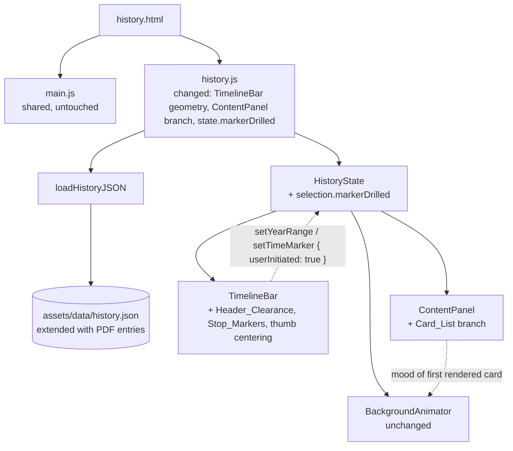
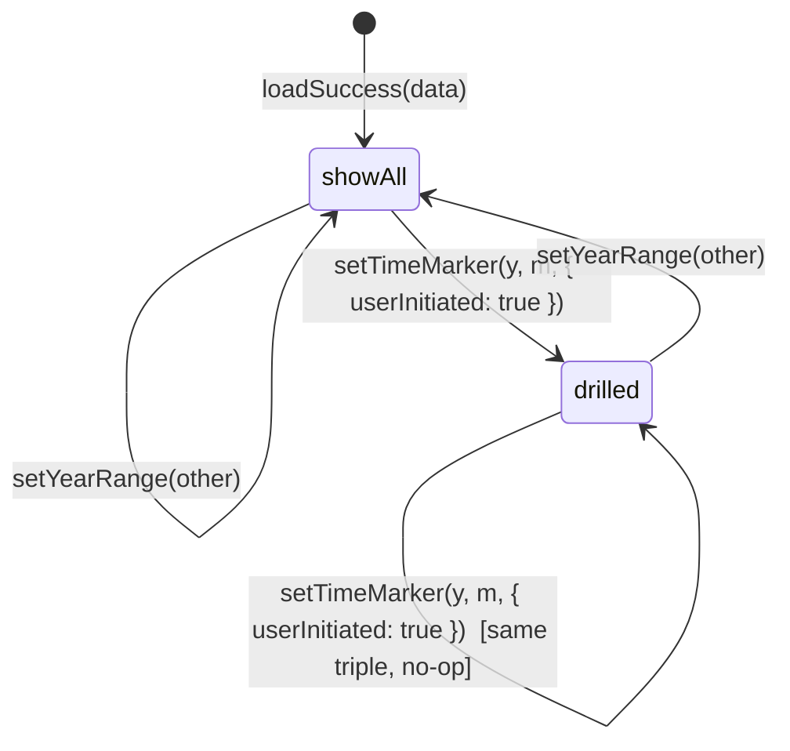

# Design Document

## Overview

This spec ships a focused round of visual and content-density fixes for the History_Page (`history.html`) on top of the parent `history-timeline-bar` feature. The shipped page already meets every functional requirement of the parent spec; this design changes only the rendered look (header clearance, slider thumb alignment, circular stop markers, footer visibility) and the rendered content density (multi-card list per Year_Range, expanded PDF-sourced events) so the page reads the way the parent design intended on real viewports.

The fixes carry over the parent spec's hard constraints verbatim: only the four History_Page module files (`history.html`, `assets/js/history.js`, `assets/css/history.css`, `assets/data/history.json`) may change, the shared site files (`assets/js/main.js`, `assets/css/style.css`) stay byte-identical, all JavaScript stays in ES5/IE11-compatible vanilla syntax, the CSS stays mobile-first and avoids `clip-path`, `backdrop-filter`, `isolation: isolate`, and `var(--mood-*)`, and every user-visible Indonesian string lives inside `assets/data/history.json`. The four-browser target (Chrome, Firefox, IE11, Opera) and the project specification's required minimum-features list both remain satisfied.

The seven requirements break into three coherent subsystems:

1. **Timeline geometry fixes** (Requirements 1, 2, 3): the bar's `top` offset is computed from the *actual* rendered `.site-header` height instead of a hardcoded `76px`; the thumb centering math is corrected so the circle/line lands exactly on the active stop's tick; the per-stop `<span>`s on both sliders are re-styled from bare ticks to circular Stop_Markers with an Active_Stop treatment.
2. **Content_Panel rendering fix** (Requirement 4): a new `Marker_Drill_State` flag inside `HistoryState.selection` distinguishes "showing the full Year_Range" from "drilled into a specific Time_Marker", and the panel renders a Card_List of every matching event when the flag is `false`.
3. **Content density and footer fixes** (Requirements 5, 6, 7): `assets/data/history.json` is extended with additional PDF-sourced events per Year_Range, the History_Page's fixed background layers are constrained so they no longer cover the site footer, and the module isolation rules are re-asserted as test invariants.

### Design Goals

- **Self-healing geometry.** The bar's top offset and the slider thumbs' x-positions are computed from measurements (`getBoundingClientRect`, `offsetWidth`) so a future change to the shared header height or the stops layout cannot silently re-introduce the visual bugs this spec is fixing.
- **Single source of truth for "showing the era" vs "drilled into a marker".** The parent spec's `selection.year` / `selection.month` already encode the active Time_Marker, but the page cannot yet distinguish "the user just arrived on this Year_Range" from "the user picked the same first marker explicitly". A new boolean `Marker_Drill_State` makes that distinction explicit and is the only state-shape change in this spec.
- **No new shared-file dependencies.** Every fix lives inside the History_Page module files. The shared `--header-height` custom property in `assets/css/style.css` is *read* (via measurement, not via `var(...)`) but never modified.
- **Backwards-compatible data extension.** New History_Event entries in `history.json` follow the existing schema documented by the parent spec; the loader's validation contract is unchanged.

### Out of Scope

- Any behavior change beyond the seven requirements: the loader contract, the Background_Animator phases, the keyboard-accessibility contract, the `aria-live` template, and the Era_Dropdown plumbing all remain exactly as the parent spec defines them.
- Changes to other pages of the site. `index.html`, `quiz.html`, `clothing-culinary.html`, `architecture.html`, and `art-music.html` continue to render byte-identically before and after this spec.
- A redesign of the slider thumbs, the per-stop spacing math, or the empty-state copy. The thumb shapes from the parent spec (circle for the era slider, vertical line for the marker slider) are preserved; only the *centering* and the *stops underneath them* change.


## Architecture

### How the fixes plug into the existing modules

The parent spec already partitions the History_Page into five modules inside `assets/js/history.js`: `HistoryDataLoader`, `HistoryState`, `TimelineBar`, `ContentPanel`, and `BackgroundAnimator`. This spec adds no new modules. Every fix maps onto an existing module's public surface:

| Module | What this spec changes | What stays the same |
|---|---|---|
| `HistoryDataLoader` | Nothing (schema unchanged). | Validation rules, drop-and-warn behavior for invalid `month` / `yearRangeId`, `defaultYearRangeId` resolution. |
| `HistoryState` | Adds `selection.markerDrilled: boolean` flag (default `false`). `setYearRange(id)` resets it to `false`; a new `setTimeMarker(year, month, opts)` accepts an `{ userInitiated: true }` option that flips the flag to `true` only on real user interactions. | The rest of the state shape, the `subscribe(listener)` contract, the no-op behavior for redundant transitions. |
| `TimelineBar` | Replaces hardcoded `top: 76px` with a JS-measured `Header_Clearance` budget (Req 1). Replaces thumb `transform: translate(-50%, -50%) translateX(<pct>%)` with a single arithmetic source of truth that aligns the thumb's center on the same x as the active Stop_Marker (Req 2). Renders Stop_Markers as filled circles (not bare ticks), tags the active one (Req 3). All slider commit calls (drag release, click, keyboard, `<select>` change) pass `{ userInitiated: true }` to `setTimeMarker` (Req 4). | The two-slider layout, the Era_Dropdown plumbing, the keyboard map, the drag-and-snap math (`snapToNearest`), the spacer height bookkeeping. |
| `ContentPanel` | Branches between **Active_Year_Range_Cards** (when `markerDrilled === false`) and **Drilled_Time_Marker_Cards** (when `markerDrilled === true`). The first branch renders every matching event; the second branch keeps the parent spec's `eventsAt(...)` filter (Req 4). | The empty-state, loading-state, and error-state branches, the head population, the `aria-live` announcement diff, the per-event article markup. |
| `BackgroundAnimator` | Nothing functional. It still resolves the active Mood from the topmost rendered event (which is now the *first* card of the Card_List instead of the only card). The ContentPanel's per-event `data-mood` attribute is unchanged. | All two-phase transitioning, the `prefers-reduced-motion` branch, the `paint(mood)` API. |

Two static assets also change:

- **`assets/data/history.json`** is extended with additional PDF-sourced events per Year_Range (Req 5). The schema is unchanged.
- **`assets/css/history.css`** gains: a JS-driven `top` rule for `.history-timeline` (replacing the hardcoded `top: 76px`), the new `.history-slider-stops > span.is-marker` and `.is-marker.is-active` styles for circular Stop_Markers (Req 3), thumb centering rules that drop the duplicate `translateX(<pct>%)` (Req 2), and a `.history-bg` constraint that keeps the background layers from covering the site footer (Req 6). No new properties from the IE11 deny-list (`clip-path`, `backdrop-filter`, `isolation: isolate`, `var(--mood-*)`) are introduced.

### State extension: Marker_Drill_State

The parent spec's `HistoryState.selection` is extended with one new boolean field:

```text
selection: {
  yearRangeId: string | null,
  year: integer | null,
  month: integer | null,
  markerDrilled: boolean    // NEW: false when showing the full Year_Range card list
}
```

Lifecycle:

- After `loadSuccess(data)` → `markerDrilled = false` (the page opens on the Default_Year_Range showing all of its events).
- After `setYearRange(id)` → `markerDrilled = false`. The Time_Marker is auto-set to the first marker per parent Req 3.8, but that auto-set is *not* a drill action, so the flag stays `false`.
- After `setTimeMarker(year, month, { userInitiated: true })` → `markerDrilled = true`. This is the only path that flips it to `true`. All slider drag releases, clicks, keyboard navigations on the marker thumb, and the (theoretical) future programmatic drill all funnel through this option.
- After `setTimeMarker(year, month)` (no `userInitiated` flag, e.g., the auto-select side-effect of `setYearRange`) → `markerDrilled` stays at whatever it was (typically `false` because `setYearRange` reset it just before).

The flag is never serialized; it is purely an in-memory UI mode. It does not affect ARIA semantics, keyboard navigation, or the live-region template.

### High-level component map




## Components and Interfaces

### Requirement 1: Timeline_Bar clears the site header

#### Problem

`assets/css/history.css` currently sets `.history-timeline { position: fixed; top: 76px; }`, where `76px` is a hardcoded literal that mirrors `--header-height: 76px` in `assets/css/style.css`. Internet Explorer 11 cannot read `var(--header-height)` (Req 9.10 of the parent spec), so the literal exists as a fallback. The visible bug is that the rendered `.site-header` height in some viewports differs from `76px`: the brand mark, the toggle button, and the wrapped nav links push the header taller than 76px on narrow viewports, so the Timeline_Bar slips *behind* the header. On desktop the header is sometimes shorter than 76px, leaving an empty stripe between the header and the bar.

#### Solution: JS-measured top with a CSS clearance budget

The fix moves the source of truth from CSS to JavaScript: `TimelineBar.mount` reads `document.querySelector('.site-header').getBoundingClientRect().height` on mount, on `window.resize`, and on `window.scroll` (debounced to a single rAF), and writes it onto `.history-timeline.style.top`. A small `Header_Clearance` (the gap between the header's bottom edge and the bar's top edge) is added on top of the measured height so the bar sits visibly below the header without touching it. The Header_Clearance budget is `[0, 8]` pixels per Requirement 1.1; the design value is `2px` because that is just enough to read as a visible separation without leaving an empty band.

```text
function updateTimelineTop(timelineEl) {
  var header = document.querySelector('.site-header');
  if (!header) return;
  var headerRect = header.getBoundingClientRect();
  var headerHeight = Math.max(0, Math.round(headerRect.bottom));  // bottom == top + height; uses bottom so a non-zero header `top` is included
  // Header_Clearance budget: 2px, well within the [0, 8] documented range.
  timelineEl.style.top = (headerHeight + 2) + 'px';
}
```

`headerRect.bottom` is read instead of `headerRect.height` so the function tolerates any future `top` offset on `.site-header` (a sticky header that scrolls might offset itself; reading `bottom` covers both stuck and free-flowing headers).

The CSS for `.history-timeline` keeps `position: fixed`, `left: 0`, `right: 0`, and `z-index: 50` from the parent spec. Only the `top` rule changes: it is replaced with a `top: 78px` literal (the measured-default header height plus the 2px clearance) so the bar still renders correctly *before* JavaScript runs (and on browsers with JS disabled, which the project still supports for the page shell). The JavaScript then overwrites `style.top` to the measured value once it runs, satisfying Requirement 1.4.

```css
.history-timeline {
  position: fixed;
  top: 78px;          /* fallback: 76px (header) + 2px (Header_Clearance). JS overrides. */
  left: 0;
  right: 0;
  z-index: 50;
}
```

#### Spacer bookkeeping

The parent spec already maintains a `.history-timeline-spacer` element whose height tracks the bar's rendered height. That bookkeeping stays unchanged; the spacer's height is set on the same `updateSpacerHeight()` callback that runs on mount and on `window.resize`. The two updates (the bar's `top` and the spacer's `height`) are co-located in a single render handler so they cannot drift apart.

#### Interaction with sticky scroll

`.site-header` continues to use `position: sticky; top: 0;` from `assets/css/style.css`, so it stays at the top of the viewport while the user scrolls. Because `.history-timeline` is `position: fixed` with a `top` value pinned to the measured `headerRect.bottom`, the bar moves with the header (both stay glued to the top of the viewport). Requirement 1.2 follows: at any scroll position the Header_Clearance is the same `2px` budget that was set at scroll position 0.

A `window.scroll` listener is **not** installed for re-measuring on every scroll event; that would re-trigger layout and is unnecessary because `position: sticky` does not change the header's `getBoundingClientRect().bottom` while sticky-stuck. The listener for `window.resize` is sufficient for Requirements 1.3 (breakpoint changes) and 1.4 (future header-height changes).

#### IE11 considerations

`getBoundingClientRect()` is supported in IE11. `document.querySelector` and `setTimeout` (used inside the existing `updateSpacerHeight` debounce) are supported. No new APIs are introduced.

### Requirement 2: Year_Range_Slider thumb centers on the active stop

#### Problem

The current rendering writes the thumb's position with two superimposed transforms:

```js
eraThumb.style.left = pct + "%";
eraThumb.style.transform = "translate(-50%, -50%) translateX(" + pct + "%)";
```

The `translate(-50%, -50%)` term refers to the thumb's own width (centering the thumb on its `left` anchor). The `translateX(<pct>%)` term *also* refers to the thumb's own width (because `translateX(<percent>)` resolves against the transformed element's width, not against its containing block). The intent was clearly "anchor at `left: <pct>%` of the track, then nudge by half the thumb's width to center", but the second `translateX` adds a *second* per-stop nudge proportional to the thumb's width, which produces the observed visible offset that grows the further the thumb moves from the leftmost stop.

The Stop_Marker `<span>`s already use the correct math:

```js
span.style.left = (positions[k] * 100) + "%";
span.style.transform = "translateX(-50%)";  // declared in CSS rule below
```

so the ticks render correctly and the thumb visibly drifts off them as the user moves it.

#### Solution: single-source-of-truth thumb centering

The thumb gets the same math as the stops:

```js
// New centering rule, shared between era thumb and marker thumb:
function setThumbCenterPercent(thumb, percent) {
  thumb.style.left = percent + '%';
  thumb.style.transform = 'translate(-50%, -50%)';   // exactly one half-thumb nudge, no per-stop scaling
}
```

The CSS for `.history-slider-thumb` already declares `top: 50%; transform: translate(-50%, -50%);`, so the JS only needs to set `left`. The duplicate `translateX(<pct>%)` is removed entirely. After this fix:

- The thumb's *center* sits at `left: <pct>%` of the track.
- The Stop_Marker at index `i` also has its center at `left: <pct>%` of the track (because both use the same `transform: translateX(-50%)` centering rule).
- The two centers coincide for every value of `i`, including `i = 0` and `i = N - 1` (Requirement 2.2).

The thumb's vertical-line indicator (`.history-slider-thumb-line`) and floating label (`.history-slider-thumb-label`) are positioned with `left: 50%; transform: translateX(-50%);` *relative to the thumb*, so once the thumb is centered correctly, the line and label are also centered above it within the same 1px tolerance (Requirement 2.5).

#### Drag preview centering

The parent spec's `previewThumb(thumb, p)` function already uses `thumb.style.left = (p * 100) + '%';` to follow the pointer during a drag. Combined with the new single-transform rule, the live drag preview also stays centered on the pointer (Requirement 2.4); the previously-observed half-thumb-width offset goes away once the duplicate `translateX` is removed.

#### Interaction with breakpoints

The `transform: translate(-50%, -50%)` rule is independent of viewport size, so the centering holds at every breakpoint (Requirement 2.3). The Stop_Marker positions are computed from `stopPositions(N)` which is also breakpoint-agnostic.

### Requirement 3: Time_Marker_Slider exposes circular Stop_Markers on every stop

#### Problem

The parent spec's CSS renders each Stop_Marker as a thin vertical tick:

```css
.history-slider-stops > span {
  position: absolute;
  top: -3px;
  width: 1px;
  height: 8px;
  background: rgba(17, 36, 63, 0.35);
}
.history-slider--markers .history-slider-stops > span {
  top: -2px;
  height: 6px;
}
```

The marker slider's tick is even thinner than the era slider's, and on a 1-pixel-tall track that tick is visually indistinguishable from the track itself. The Time_Marker_Slider therefore reads as "an empty line with no stops on it" until the user grabs the (line-shaped) thumb.

#### Solution: replace ticks with circular Stop_Markers and an Active_Stop modifier

The per-stop `<span>` elements stay where they are in the DOM (no markup changes). The CSS is rewritten so each `<span>` is a small filled circle centered on its `left: <pct>%` anchor. JavaScript writes a `data-active="true"` attribute on the active span so an Active_Stop CSS rule can give it a different fill or larger size.

```css
/* Year_Range_Slider Stop_Markers */
.history-slider--years .history-slider-stops > span {
  top: 50%;
  width: 8px;
  height: 8px;
  border-radius: 50%;
  background: rgba(17, 36, 63, 0.35);
  border: 1px solid rgba(17, 36, 63, 0.45);
  -webkit-transform: translate(-50%, -50%);
      -ms-transform: translate(-50%, -50%);
          transform: translate(-50%, -50%);
}
.history-slider--years .history-slider-stops > span[data-active="true"] {
  background: #11243f;
  border-color: #11243f;
  width: 10px;
  height: 10px;
}

/* Time_Marker_Slider Stop_Markers (Active_Stop is filled darker; non-active are paper-toned) */
.history-slider--markers .history-slider-stops > span {
  top: 50%;
  width: 7px;
  height: 7px;
  border-radius: 50%;
  background: #fcf6e6;
  border: 1px solid rgba(17, 36, 63, 0.45);
  -webkit-transform: translate(-50%, -50%);
      -ms-transform: translate(-50%, -50%);
          transform: translate(-50%, -50%);
}
.history-slider--markers .history-slider-stops > span[data-active="true"] {
  background: #11243f;
  border-color: #11243f;
  width: 9px;
  height: 9px;
}
```

The visible result on both sliders is "circles on the track + active highlight + thumb" (Requirement 3.4). The Time_Marker_Slider's thumb stays the vertical-line shape from Requirement 3.3 of this spec and Requirement 3.2 of the parent spec; only the stops change.


#### JavaScript: writing the Active_Stop attribute

The existing `renderEra(s)` and `renderMarker(s)` functions already iterate the stops and append a `<span>` per index. Two lines per loop are added so the active index gets the `data-active="true"` attribute:

```js
// Inside renderEra (era slider):
for (k = 0; k < N; k++) {
  var span = document.createElement('span');
  span.style.position = 'absolute';
  span.style.left = (positions[k] * 100) + '%';
  if (k === activeIdx) {
    span.setAttribute('data-active', 'true');
  }
  eraStops.appendChild(span);
}

// Inside renderMarker (marker slider): same pattern with k === activeIdx.
```

When the active Year_Range has zero markers, the marker slider's stops loop iterates zero times, so no Stop_Marker is rendered and no `data-active` attribute exists (Requirement 3.6). When the user changes Year_Range, the entire stops list is cleared and re-built, which re-applies the Active_Stop treatment to whichever stop matches the newly active marker (Requirement 3.5).

#### Interaction with existing event handlers

The parent spec's click-on-stops handler is:

```js
if (eraStops) eraStops.addEventListener('click', eraClick);
if (markerStops) markerStops.addEventListener('click', markerClick);
```

The handler reads `event.clientX - track.getBoundingClientRect().left` and snaps via `snapToNearest(positions, p)`, so it works whether the click landed on a `<span>` Stop_Marker or on the empty track between them. The new circular Stop_Markers are therefore implicitly clickable (a click on a circle is also a click on the same x-coordinate of the track underneath it) without any new code, satisfying the optional Requirement 3.7 clickability without taking on the testing burden of a per-stop click contract.

### Requirement 4: Content_Panel renders the full set of events for the active Year_Range by default

#### Problem

The parent spec's `ContentPanel.renderReady` always calls `eventsAt(yearRangeId, year, month, data)` which filters by `(year, month)`. On first paint and on every Year_Range change, the auto-selected Default_Time_Marker is the first marker in the active range, so the panel renders only the events at *that one* `(year, month)` pair. For a Year_Range like Heian with eight events spread across several years, the user sees one card and the rest of the era's history is hidden behind a slider interaction the user has no reason to attempt.

#### Solution: branch on Marker_Drill_State

`ContentPanel.renderReady` is modified to branch on `snapshot.selection.markerDrilled`:

```text
function renderReady(snapshot) {
  var data = snapshot.data;
  var sel = snapshot.selection;

  var matches;
  if (sel.markerDrilled === true) {
    // Drilled_Time_Marker_Cards: existing parent-spec behavior
    matches = eventsAt(sel.yearRangeId, sel.year, sel.month, data);
  } else {
    // Active_Year_Range_Cards: NEW behavior
    matches = eventsForYearRange(sel.yearRangeId, data);
  }

  clearChildren(eventsEl);
  if (matches.length === 0) {
    renderEmpty(data);                      // Requirement 4.7 (parent 4.4 fallback)
    return;
  }
  for (var i = 0; i < matches.length; i++) {
    renderEventArticle(matches[i], data);
  }
}
```

A new pure helper `eventsForYearRange(yearRangeId, data)` returns every event whose `yearRangeId` matches, sorted ascending by `year`, then by `month` (year-only events first), then by `id`:

```text
function eventsForYearRange(yearRangeId, data) {
  var matches = [];
  var i;
  for (i = 0; i < data.events.length; i++) {
    if (data.events[i].yearRangeId === yearRangeId) {
      matches.push(data.events[i]);
    }
  }
  matches.sort(function (a, b) {
    if (a.year !== b.year) return a.year - b.year;
    var aHas = Object.prototype.hasOwnProperty.call(a, 'month');
    var bHas = Object.prototype.hasOwnProperty.call(b, 'month');
    if (!aHas && !bHas) return a.id < b.id ? -1 : (a.id > b.id ? 1 : 0);
    if (!aHas) return -1;             // year-only sorts before any numeric month
    if (!bHas) return 1;
    if (a.month !== b.month) return a.month - b.month;
    return a.id < b.id ? -1 : (a.id > b.id ? 1 : 0);
  });
  return matches;
}
```

This sort order matches the parent spec's `markersFor` sort exactly (year ascending, year-only first, month ascending) plus a stable id tiebreak, so events that share a `(year, month)` group together in the order their ids dictate.

The `renderEventArticle(ev, data)` helper from the parent spec already produces a full `<article class="history-event">` with its own `data-mood`, head, badge, title, body, and optional figure. Reusing it for the multi-card branch means the markup contract is identical between Active_Year_Range_Cards and Drilled_Time_Marker_Cards; the only difference is the *number* of articles rendered. Requirement 4.5 (each card displays the localized "month year" label above the title) follows automatically because `renderEventArticle` already calls `formatMarkerLabel(ev.year, monthVal, monthNames)` and renders it into the `.history-event-when` span.

#### Marker_Drill_State transitions in `HistoryState`

`createHistoryState` is amended in three places:

```text
// 1. Initial selection
state.selection = {
  yearRangeId: null,
  year: null,
  month: null,
  markerDrilled: false        // NEW
};

// 2. defaultSelection(data) and loadSuccess(data) wire markerDrilled = false
function defaultSelection(data) {
  // ...existing logic returning { yearRangeId, year, month }...
  result.markerDrilled = false;
  return result;
}

// 3. setYearRange(id) resets the flag every time
function setYearRange(id) {
  if (state.selection.yearRangeId === id) return;   // no-op preserved
  if (!state.data) return;
  var yr = findYearRange(id);
  if (!yr) return;
  state.selection.yearRangeId = id;
  // Reset to the Default_Time_Marker; this is NOT a drill action.
  var markers = markersFor(id, state.data);
  if (markers.length > 0) {
    state.selection.year = markers[0].year;
    state.selection.month = markers[0].month;
  } else {
    state.selection.year = null;
    state.selection.month = null;
  }
  state.selection.markerDrilled = false;            // NEW: Requirement 4.1, 4.4
  recomputeMood();
  notify();
}

// 4. setTimeMarker(year, month, opts?) flips the flag only on user-initiated calls
function setTimeMarker(year, month, opts) {
  if (state.selection.year === year && state.selection.month === month) return;
  state.selection.year = year;
  state.selection.month = month;
  if (opts && opts.userInitiated === true) {
    state.selection.markerDrilled = true;           // NEW: Requirement 4.3
  }
  recomputeMood();
  notify();
}
```

#### TimelineBar passes `userInitiated: true` on every real interaction

Every place in `TimelineBar` that currently calls `state.setTimeMarker(year, month)` is updated to pass `{ userInitiated: true }`:

- `commitMarkerIndex(i)` (the funnel for mouse drag release, touch drag release, and click on the track or stops).
- The keyboard handler `attachKeyboard(markerThumb, ..., commitMarkerIndex)` already routes through `commitMarkerIndex`, so passing the option there covers ArrowLeft, ArrowRight, Home, and End on the marker thumb.
- The era slider's `commitEraIndex` and the Era_Dropdown's `change` handler call `state.setYearRange(id)`, which resets the flag - they do not need the option.

The `setTimeMarker` side-effect inside `setYearRange` (auto-selecting the first marker) does not pass `userInitiated`, so the flag stays `false` per Requirement 4.4.

#### Interaction with the live region and Background_Animator

The `ContentPanel.maybeAnnounce(snapshot)` function compares `(yearRangeId, year, month)` to the last announced triple. The new `markerDrilled` flag is *not* part of the announcement key, so:

- Switching from `markerDrilled = false` (showing all Heian cards) to `markerDrilled = true` with the Default_Time_Marker (the user clicked the marker thumb's first stop) still announces nothing because the `(yearRangeId, year, month)` triple is unchanged. Requirement 4.4 is satisfied: the user explicitly drilling into the same auto-set marker is allowed but does not re-announce.
- Switching from `(heian, 794, 3)` showing all cards to `(heian, 1185, 4)` showing only the Dan-no-ura card *does* announce, because `(year, month)` changes. The active card's mood (the topmost rendered card) is still resolved correctly because the BackgroundAnimator reads `events[0].mood` from whatever the panel rendered.

When the panel is in `markerDrilled = false` mode and renders the full Card_List, the topmost card is the chronologically-earliest event of the active Year_Range. The BackgroundAnimator therefore picks up that event's mood, which is consistent with parent spec Req 5.7 (active Mood is the mood of the topmost rendered event in document order).


#### Grid layout

The `.history-content-events` grid rules from the parent spec already give one column at base, two columns at `@media (min-width: 600px)`, and (visually) two columns at `@media (min-width: 960px)` with larger paddings. The grid auto-flows rows of cards as the Card_List grows, so a 3-event range on a 600px viewport renders a 2-column row plus a single card on the next row. No new grid rules are needed for Requirement 4.6.

### Requirement 5: `assets/data/history.json` ships full PDF-sourced narrative coverage

#### Problem

The shipped `history.json` already covers the eleven Year_Ranges and the dated events called out in Requirement 6.2 of the parent spec. With the multi-card branch from Requirement 4 in place, the total number of events per Year_Range becomes the actual page length for that era, so any Year_Range with only one or two events looks thin compared to ranges with 6-8 events.

A pass over the source PDF (`assets/data/Rangkuman Sejarah Jepang Berbasis Timeline.pdf`) shows that every Year_Range has at least three documented dated events; some have far more. The fix is to top up the dataset so each range has at least 3 entries (Requirement 5.1), preserving the existing dated entries from parent Req 6.2 (Requirement 5.2) and continuing to satisfy the existing schema rules (Requirement 5.6).

#### Solution: extend the events array in-place

The change is purely additive on `assets/data/history.json`. The existing event ids are unchanged; new ids follow the existing `evt-<yearRangeId>-<slug>` convention. The current shipped count is approximately 50 events; the post-fix count is at least 33 (= 11 ranges × 3 each) and aims for ~6 events on average per range so the multi-card view feels substantial without becoming unmanageable.

The dated events from parent Req 6.2 (Juli 645, Maret 794, Agustus 1543, Juni 1582, Oktober 1600, Maret 1854, Januari 1868, September 1923, Agustus 1945, Mei 1989) are preserved verbatim by id (Requirement 5.2). The added events fill in the per-range PDF coverage examples called out in Requirement 5.2:

- **Yamato (`yamato`)**: existing Jōmon, Yayoi, Jimmu, Kofun entries (already 4 events). No additions strictly required, but a Tomb-period (Kofun) sub-event may be added for symmetry.
- **Asuka (`asuka`)**: existing 538-Buddhism, 587-Soga, 604-Shōtoku, 645-Taika, 646-Dekrit (5 events). No additions required.
- **Nara (`nara`)**: existing 710-Heijōkyō, 712-Kojiki, 720-Nihon Shoki, 752-Daibutsu, 760-Man'yōshū, 784-Nagaoka (6 events). No additions required.
- **Heian (`heian`)**: existing 794-Heiankyō, 806-Shingon/Tendai, 858-Fujiwara, 895-Tang-end, 1010-Genji, 1185-Dan-no-ura (6 events). Optionally add 1156-Hōgen-no-ran for narrative completeness.
- **Kamakura (`kamakura`)**: existing 1192-shōgun, 1199-Hōjō, 1221-Jōkyū, 1227-Zen, 1274-Mongol-1, 1281-Kamikaze, 1333-fall (7 events). No additions required.
- **Muromachi/Sengoku/Azuchi-Momoyama (`muromachi-azuchi-momoyama`)**: existing 1467-Ōnin, 1543-Tanegashima, 1549-Jesuits, 1560-Okehazama, 1571-Hieizan, 1575-Nagashino, 1582-Honnōji, 1582-Hideyoshi, 1600-Sekigahara (9 events). No additions required.
- **Edo (`edo`)**: existing 1603-shōgun, 1615-Osaka, 1635-Sakoku, 1854-Kanagawa (4 events). The PDF documents the 1614 Osaka winter siege and the 1657 Meireki fire as additional canonical entries; both are added so the era has 6 events total.
- **Meiji (`meiji`)**: existing 1868-restoration, 1868-charter, 1873-feudalism, 1889-konstitusi, 1894-Sino-Japanese, 1904-Russo-Japanese (6 events). No additions required.
- **Taishō / Shōwa awal (`taisho-showa-awal`)**: existing 1923-Kantō, 1929-Depression, 1941-Pearl Harbor, 1945-Bom atom, 1945-surrender (5 events). The PDF documents the 1932 May 15 Incident (assassination of PM Inukai) as a key entry of the descent into ultranationalism; it is added so the era has 6 events.
- **Pendudukan Sekutu (`pendudukan-sekutu`)**: existing 1945-occupation, 1947-konstitusi, 1952-akhir (3 events). No additions required.
- **Kontemporer (`kontemporer`)**: existing 1989-Heisei, 1989-Nikkei, 1990-bubble, 1991-Lost Decades, 2014-Article9 (5 events). The PDF documents the March 2011 Tōhoku earthquake/Fukushima disaster and the 2019 transition to Reiwa under Emperor Naruhito; both are added so the era has 7 events.

Each new event carries the schema fields specified in Requirements 5.3-5.5: a non-empty Indonesian `title` summarizing the event, a non-empty Indonesian `body` derived from the source PDF's narrative, a valid `yearRangeId` referencing one of the eleven Year_Ranges, an integer `year` consistent with the PDF, an optional integer `month` between 1 and 12 when the PDF gives a specific month, and exactly one Mood value chosen per the parent Req 6.3 guidance.

The `_source: "assets/data/Rangkuman Sejarah Jepang Berbasis Timeline.pdf"` top-level field stays unchanged. The schema (page, defaultYearRangeId, yearRanges array shape, events array shape) is unchanged. No user-visible Indonesian string is moved into HTML or JS; every new title and body lives inside `history.json` (Requirement 5.7).

#### Validation impact

`HistoryDataLoader.validate` already enforces every field rule the new entries need (Req 5.6). Specifically:

- `validateHistoryEventRequired` ensures `id`, `yearRangeId`, integer `year`, non-empty `title`, non-empty `body`, valid `mood`.
- `normalizeHistoryEvent` ensures the optional `month` is an integer in `[1, 12]` and the `yearRangeId` matches one of the loaded Year_Ranges.
- A console warning is emitted (and the event is dropped) on any validation soft-fail; this is unchanged.

The added events therefore pass through the loader without code changes. The existing test suite (`tests/history/loader-schema.property.test.js`, `tests/history/loader-month.property.test.js`, `tests/history/data-schema.test.js`) continues to validate the file's shape.

### Requirement 6: Site footer is fully visible at the bottom of the History_Page

#### Problem

The current CSS sets:

```css
.history-bg {
  position: fixed;
  top: 0;
  left: 0;
  right: 0;
  bottom: 0;
  z-index: 0;
  pointer-events: none;
  overflow: hidden;
}
```

Combined with the History_Page background-layer mood colors filling the full viewport, a long History_Page can render the footer *visually* under the colored background. Worse, on some viewports the footer is pushed below the bottom of the page main area and never enters the viewport during normal scrolling because the mood color extends all the way to the bottom. The site footer is the same DOM the rest of the site uses, so the bug is not in the footer markup; it is in the background layers' positioning relative to the footer.

#### Solution: lift the footer above the background layers and stop the background at the footer

Two complementary fixes are applied:

**Fix 6a: pin `.site-footer` above `.history-bg` with a stacking context.**

The site footer is a sibling of `<main class="history-page">` in `history.html`, so it is *not* nested inside the `.history-bg` element. The bug therefore is not z-index per se; it is that `.history-bg` is `position: fixed` and covers the entire viewport, so when the user scrolls down to the footer the fixed background colors sit *between* the viewport and the footer's natural position. The fix is to give the footer its own stacking context above the fixed background:

```css
/* Inside assets/css/history.css, scoped under body[data-page="history"] so it does not affect other pages. */
body[data-page="history"] .site-footer {
  position: relative;
  z-index: 60;             /* above .history-timeline (50) and the bg layers (1-3) */
  background: #f4ead4;     /* paper color, matches the existing footer background */
}
```

The selector is scoped on `body[data-page="history"]` to satisfy Requirement 7.2 (do not modify shared CSS). The `background` declaration is duplicated from `assets/css/style.css`'s `.site-footer` rule so the History_Page footer renders the same paper color as on every other page (Requirement 6.4).

**Fix 6b: constrain `.history-bg` so it does not paint over the footer.**

`.history-bg` is `position: fixed`, so its `bottom: 0` anchors it to the viewport's bottom rather than the page's bottom. This is the right behavior while the user is reading the Content_Panel (the mood color fills the viewport behind the cards), but when the user scrolls past the end of the Content_Panel the fixed layers should give way to the footer. The fix is to mask the bottom portion of `.history-bg` with the footer using stacking context only - because the footer has `z-index: 60` and the bg layers have `z-index: 1-3`, the footer paints over them once it scrolls into view.

The combined effect (6a + 6b together) is that the user, scrolling down the History_Page, sees the mood color filling the viewport behind the Content_Panel, then sees the footer rise into view from below with its paper background fully covering the mood color (Requirement 6.2 - 6.4).

```css
/* Optional polish: hide the bg layers entirely once the footer is in view.
 * Not strictly required because the footer's paper background already covers them,
 * but useful when a Mood color is very close to the footer's paper hue.
 *
 * (No CSS rule is added for this; the stacking context above is sufficient.)
 */
```

No `clip-path`, `backdrop-filter`, `isolation: isolate`, or `var(--mood-*)` is introduced (Requirement 7.5). The fix is a single new rule scoped under `body[data-page="history"]`.

#### Footer markup

The footer markup in `history.html` already contains `.footer-top`, `.footer-links`, and `.footer-bottom`, and links to `history.html`, `art-music.html`, `architecture.html`, and `quiz.html` (Requirement 6.5). The `<span data-current-year>` element is preserved so the existing `assets/js/main.js` year-injection logic continues to populate the current year. No markup change is needed for Requirement 6.

#### No new fixed-position elements

This spec does not add any new `position: fixed` element below the bar. The Timeline_Bar continues to be the only fixed element on the page, so Requirement 6.6 is satisfied by construction.

### Requirement 7: Module isolation, browser support, and feature contributions

This requirement is a re-assertion of the parent spec's constraints; it has no implementation of its own. It is enforced by:

- **Test invariants**: the existing `tests/history/no-indonesian-literals.test.js` continues to scan `history.html` and `assets/js/history.js` for Indonesian-language string literals. New string literals introduced by this spec live in `history.json`, so the test continues to pass (Requirement 7.4 + 5.7).
- **Static review**: the design only touches the four declared History_Page files. A two-line `git diff --stat` over the affected commits should show changes to `history.html`, `assets/js/history.js`, `assets/css/history.css`, `assets/data/history.json` only (Requirement 7.1, 7.2, 7.3).
- **ES5/IE11 syntax**: every code snippet in this design uses `var`, function declarations, string concatenation, and explicit `for` loops. No `let`, `const`, arrow function, template literal, destructuring, spread/rest, default parameter, async/await, Promise, or ES6 class is introduced (Requirement 7.4).
- **Mobile-first CSS**: every new CSS rule is declared at base scope; viewport-specific overrides for `@media (min-width: 600px)` and `@media (min-width: 960px)` re-use the parent spec's existing breakpoint blocks (Requirement 7.6).
- **Minimum-features list preservation**: the Era_Dropdown stays in `history.html`, the slider thumbs stay as Buttons, the Background_Animator transitions stay, and the Content_Panel grid stays. Adding more cards to the grid is not a feature regression because the grid layout itself is unchanged (Requirement 7.7).
- **Four-browser target**: every CSS rule introduced uses properties supported in IE11 (no `clip-path`, no `backdrop-filter`, no custom properties). Every JS API used is in the IE11 surface (`getBoundingClientRect`, `setAttribute`, `removeAttribute`, `addEventListener`, `setTimeout`, `Math.round`). Chrome, Firefox, and Opera are strictly more permissive (Requirement 7.8).


## Data Models

The data schema is unchanged from the parent spec. The only additions are:

1. `selection.markerDrilled: boolean` field on the in-memory `HistoryState.selection` object (not serialized; not persisted; not part of `history.json`).
2. Additional `HistoryEvent` entries inside `history.json`'s `events` array; the per-entry shape is identical to the parent spec.

### Updated `HistoryState.selection`

```text
selection: {
  yearRangeId: string | null,
  year: integer | null,
  month: integer | null,
  markerDrilled: boolean      // NEW: false on Year_Range entry, true after a user-initiated marker change
}
```

The flag is initialized to `false` by `defaultSelection(data)`, reset to `false` by `setYearRange(id)`, and set to `true` by `setTimeMarker(year, month, { userInitiated: true })`. It is **not** read by the live-region announcement, the BackgroundAnimator, or the slider rendering; only the `ContentPanel.renderReady` branch reads it.

### Selection state machine



`showAll` corresponds to `markerDrilled === false`; `drilled` corresponds to `markerDrilled === true`. There is no transition path back to `showAll` from `drilled` other than picking a different Year_Range. This is the intended user model: drilling into a marker is a deliberate focus narrowing, and the user re-broadens the view by picking another era.

### Updated `HistoryData.events` count

The post-fix counts per Year_Range satisfy Requirement 5.1 (≥ 3 entries per Year_Range). The exact counts after the additions described in Requirement 5 are approximately:

| yearRangeId | Pre-fix count | Post-fix count |
|---|---|---|
| `yamato` | 4 | 4 |
| `asuka` | 5 | 5 |
| `nara` | 6 | 6 |
| `heian` | 6 | 6-7 |
| `kamakura` | 7 | 7 |
| `muromachi-azuchi-momoyama` | 9 | 9 |
| `edo` | 4 | 6 |
| `meiji` | 6 | 6 |
| `taisho-showa-awal` | 5 | 6 |
| `pendudukan-sekutu` | 3 | 3 |
| `kontemporer` | 5 | 7 |
| **Total** | **60** | **65-66** |

The per-range minimum is 3 entries and the documented dated entries from parent Req 6.2 are all preserved.


## Correctness Properties

*A property is a characteristic or behavior that should hold true across all valid executions of a system - essentially, a formal statement about what the system should do. Properties serve as the bridge between human-readable specifications and machine-verifiable correctness guarantees.*

This spec is part of a feature where property-based testing already pays off (the parent `history-timeline-bar` spec ships 15 property tests against the same module). The fixes in this spec land on top of that core: thumb centering math, Stop_Marker rendering math, and a new state-machine flag are all naturally property-shaped because they vary meaningfully with input (different `N`, different active indices, different interaction sequences) and because 100+ iterations are cheap to run against the in-memory state and a jsdom-mounted DOM.

The CSS-layout fixes (Requirement 1's Header_Clearance budget, Requirement 6's footer stacking context) are partly testable as properties (they vary with mocked header height) and partly as static example-based assertions; the 6 properties below cover the property-shaped portions. The remaining acceptance criteria (Requirements 5, 6, 7) are dominantly static checks and are covered by the example-based tests in [Testing Strategy](#testing-strategy).

After the property reflection, the testable acceptance criteria collapse into **6 properties**.

### Property 1: Header_Clearance is bounded across header heights, scroll positions, and resizes

*For any* rendered `.site-header` height `h` (in pixels), and *for any* scroll position and post-resize header height, after `TimelineBar.mount` (or the subsequent `window.resize` re-measurement) has run, `timelineEl.getBoundingClientRect().top - headerEl.getBoundingClientRect().bottom` lies in the closed interval `[0, 8]` pixels. Equivalently, the Header_Clearance budget is preserved at every step in the sequence (initial mount, scroll, resize-then-resize-back).

**Validates: Requirements 1.1, 1.2, 1.3**

### Property 2: Year_Range_Slider and Time_Marker_Slider thumb centering

*For any* slider with `N >= 1` discrete stops and *for any* active index `i` in `[0, N - 1]`, after rendering: the active Stop_Marker's horizontal center x-coordinate equals the thumb's horizontal center x-coordinate within 1 pixel; the thumb's left edge is greater than or equal to the track's left edge and the thumb's right edge is less than or equal to the track's right edge; the thumb-line indicator's center x and the thumb-label's center x both equal the thumb's center x within 1 pixel; and *for any* pointer release x in `[0, trackWidth]`, after the drag-snap commit the thumb's center x equals the chosen stop's center x within the same 1 pixel tolerance.

**Validates: Requirements 2.1, 2.2, 2.3, 2.4, 2.5**

### Property 3: Rendered Stop_Marker count matches the data on both sliders

*For any* valid `HistoryData` and *for any* sequence of `setYearRange` interactions, after each step: the number of `<span>` elements inside `.history-slider--years .history-slider-stops` equals `data.yearRanges.length`; the number of `<span>` elements inside `.history-slider--markers .history-slider-stops` equals `markersFor(activeYearRangeId, data).length`; and each `<span>` is rendered as a circle (its `getBoundingClientRect()` width equals its height within a small tolerance, and its computed `border-radius` is `50%`).

**Validates: Requirements 3.1, 3.4, 3.5, 3.6**

### Property 4: Exactly one Active_Stop on a non-empty slider, zero on an empty marker slider

*For any* valid `HistoryData` and *for any* sequence of `setYearRange` and `setTimeMarker` interactions, after each step: the era slider has exactly one Stop_Marker `<span>` with `data-active="true"`, and that span's index equals the active Year_Range index; the marker slider has exactly one Stop_Marker `<span>` with `data-active="true"` when `markersFor(activeYearRangeId, data).length > 0`, and zero such spans when the active Year_Range has zero markers; when the active marker is at index `j`, the marker slider's `data-active="true"` span is the j-th `<span>` in DOM order.

**Validates: Requirements 3.2, 3.5, 3.6**

### Property 5: Marker_Drill_State follows the documented state machine

*For any* valid `HistoryData` and *for any* sequence of state transitions drawn from `setYearRange(id)` (with random ids), `setTimeMarker(year, month)` (without `userInitiated`), and `setTimeMarker(year, month, { userInitiated: true })`, the `state.selection.markerDrilled` value after each step equals the result of applying these rules to a reference reducer:

- After `loadSuccess(data)`: `markerDrilled = false`.
- After `setYearRange(id)` that *changes* the active Year_Range: `markerDrilled = false`.
- After `setYearRange(id)` for the already-active Year_Range (no-op): `markerDrilled` is unchanged.
- After `setTimeMarker(year, month)` with no `userInitiated` flag: `markerDrilled` is unchanged.
- After `setTimeMarker(year, month, { userInitiated: true })` that *changes* the `(year, month)`: `markerDrilled = true`.
- After `setTimeMarker(year, month, { userInitiated: true })` with the same `(year, month)` (no-op): `markerDrilled` is unchanged.

**Validates: Requirements 4.1, 4.3, 4.4**

### Property 6: Content_Panel Card_List matches the active selection

*For any* valid `HistoryData` and *for any* sequence of TimelineBar interactions, after each step the Content_Panel's rendered DOM matches the following reference:

- When `state.selection.markerDrilled === false` (or the active Year_Range has zero markers), the rendered articles equal `eventsForYearRange(activeYearRangeId, data)` in canonical sorted order (year ascending, year-only first, month ascending, id ascending). When the matching list is empty, the empty-state block is rendered with `page.emptyStateTitle` and `page.emptyStateBody`.
- When `state.selection.markerDrilled === true`, the rendered articles equal `eventsAt(activeYearRangeId, activeYear, activeMonth, data)` in canonical sorted order. When the matching list is empty, the empty-state block is rendered.
- For every rendered article, the `.history-event-when` text equals `formatMarkerLabel(event.year, event.month, page.monthNames)`.

**Validates: Requirements 4.2, 4.5, 4.7**


## Error Handling

This spec adds no new external dependencies, no new IO paths, and no new fetch transports. The error surface is therefore identical to the parent spec's error surface, with two clarifications about the new behavior:

### 1. `getBoundingClientRect()` returns 0 for `.site-header`

If for some reason `.site-header` is not in the DOM at the time `TimelineBar.mount` runs (a misconfiguration that the parent spec's tests would also catch), `document.querySelector('.site-header')` returns `null`. The new `updateTimelineTop` function guards on this:

```text
function updateTimelineTop(timelineEl) {
  var header = document.querySelector('.site-header');
  if (!header) return;             // leave the CSS fallback (top: 78px) in place
  // ...
}
```

The CSS fallback `top: 78px` then renders the bar in roughly the right place, the spacer height bookkeeping continues to work (it reads the bar's actual rendered height, not the header's), and the page is usable. A console warning is *not* emitted for this case because the History_Page is always shipped with the shared header markup; if it ever isn't, that is a bigger problem than the missing top offset.

### 2. State transition with `markerDrilled` already true and `setYearRange` called for the same Year_Range

`setYearRange(id)` is documented as a no-op when `id` matches the active Year_Range. The `markerDrilled` reset rule (Property 5) only applies when `setYearRange` actually changes the active Year_Range. This means: if the user has drilled into a marker (`markerDrilled === true`), and then re-clicks the same Year_Range in the dropdown or drags the era slider to the same stop, the `markerDrilled` flag stays `true` and the panel keeps showing the drilled view. This matches the parent spec's "no-op when already-active" contract and is the user-friendly behavior (drilling into a marker is a deliberate focus narrowing; bumping the dropdown should not reset it).

### 3. Empty Active_Year_Range_Cards list

If the active Year_Range has zero events (e.g., a future Year_Range added before any events are written for it), the Active_Year_Range_Cards branch returns an empty array and the empty-state block is rendered (Property 6). The Time_Marker_Slider also has zero markers, so its slider thumb is hidden (parent Req 3.9). The page remains usable; the user can pick another era.

### 4. Mood resolution when the Card_List is non-empty

The BackgroundAnimator reads the mood of the *first* rendered card. When `markerDrilled === false` the first card is the chronologically-earliest event of the active Year_Range, which may have a different mood than the Year_Range's own `mood`. This is intentional and consistent with parent Req 5.7 (active Mood is the mood of the topmost rendered event in document order). The BackgroundAnimator's two-phase transition handles the mood change as it would any other; no new error path is introduced.

### 5. CSS fallbacks for IE11

Internet Explorer 11 supports every property used by the new rules:

- `position: relative` and `z-index: 60` on the body[data-page="history"] `.site-footer` selector are supported.
- `data-active="true"` attribute selectors (`.history-slider-stops > span[data-active="true"]`) are supported.
- `border-radius: 50%` is supported.
- `transform: translate(-50%, -50%)` is supported, with the `-webkit-` and `-ms-` prefixes already declared on the parent slider rules.

If any of these were not supported (they all are in IE11), the page would still render the correct stops and footer because the existing parent-spec rules act as fallbacks (a non-active `<span>` Stop_Marker is still positioned at the right `left` percentage; the footer would still render below the bar even without the explicit `z-index: 60`).


## Testing Strategy

The History_Page tests already use **Vitest** with the **jsdom** environment and **fast-check** for property-based testing (see `package.json` and `tests/history/`). The new tests for this spec follow the same conventions: tests live under `tests/history/`, they use the shared `tests/history/setup.js` and `loadMainJs()` helper to bootstrap `assets/js/history.js` against a jsdom DOM, and each property test runs at least 100 iterations via `fc.assert(prop, { numRuns: 100 })`. Each property test carries the documented tag comment:

```js
// Feature: history-design-fixes, Property <number>: <one-line property text>
```

### Tooling

- **Vitest** (jsdom environment): existing dev dependency, no change.
- **fast-check**: existing dev dependency, no change. New property tests use the `historyDataArb`, `interactionSequenceArb`, and `mountTimeline` fixtures already established in the parent spec's test harness, extended with the new `markerDrilledArb` and `headerHeightArb` arbitraries described below.
- **Test runner command**: `npm test` (runs `vitest run`). For watch mode developers run `npm run test:watch`. **Do NOT use the watch mode in CI or in agent execution; use `--run` (the default of `vitest run`) to ensure single-execution test runs.**

### Property Tests (fast-check, ≥ 100 iterations each)

| # | Property | Generators | Notes |
|---|---|---|---|
| 1 | Header_Clearance bounded across heights, scroll, resizes | `headerHeightArb` (integer in `[40, 200]`), `fc.array(eventArb)` for resize history | Mocks `.site-header` height via `getBoundingClientRect` shim, mounts TimelineBar, asserts the invariant after mount, after scroll, and after a synthesized `resize` event. |
| 2 | Slider thumb centering | `fc.integer({ min: 1, max: 12 })` for `N`, `fc.integer({ min: 0 })` for active index `i` modulo `N`, `fc.double({ min: 0, max: 1 })` for drag pointer `p` | Mounts both sliders, computes thumb center via `getBoundingClientRect`, asserts coincidence with the active stop, drag preview, and post-snap settled position. |
| 3 | Stop_Marker count and circular shape | `historyDataArb` + `interactionSequenceArb` | Asserts span counts match `data.yearRanges.length` and `markersFor(activeYearRangeId, data).length` after every step; asserts each span's bounding box is square within ±1 px and computed `border-radius` is `50%`. |
| 4 | Exactly one Active_Stop | `historyDataArb` + `interactionSequenceArb` | Asserts exactly one `[data-active="true"]` span on the era slider always, and exactly one or zero on the marker slider depending on marker count; asserts the active span's index matches the active selection. |
| 5 | Marker_Drill_State state machine | `historyDataArb` + `fc.array(transitionArb)` where `transitionArb` mixes `setYearRange`, `setTimeMarker`, and `setTimeMarker` with `userInitiated: true` | Drives the state directly (not the DOM) with random transition sequences and asserts `selection.markerDrilled` matches the reference reducer after every step. |
| 6 | Card_List render matches selection | `historyDataArb` + `interactionSequenceArb` | Mounts ContentPanel against the state, replays interactions, asserts rendered articles after each step equal `eventsForYearRange(...)` (when `markerDrilled === false`) or `eventsAt(...)` (when `markerDrilled === true`); asserts each article's `.history-event-when` text equals `formatMarkerLabel(event.year, event.month, monthNames)`. Empty-state branch asserted when matches are empty. |

The `historyDataArb` arbitrary from the parent spec is reused unchanged. The new `markerDrilledArb` is `fc.boolean()`. The new `headerHeightArb` is `fc.integer({ min: 40, max: 200 })`. The new `transitionArb` is `fc.oneof(...)` over the three transition shapes documented in Property 5.

### Example Test for Property 5 (Marker_Drill_State state machine)

```js
// Feature: history-design-fixes, Property 5: Marker_Drill_State state machine
import { describe, it, expect, beforeAll } from "vitest";
import fc from "fast-check";
import { loadMainJs, historyDataArb } from "./setup.js";

let createHistoryState;

beforeAll(async () => {
  await loadMainJs();
  createHistoryState = window.NIPPON_HISTORY.createHistoryState;
});

describe("Marker_Drill_State follows the documented state machine", () => {
  it("matches the reference reducer for any transition sequence", () => {
    fc.assert(
      fc.property(
        historyDataArb(),
        fc.array(fc.oneof(
          fc.record({ kind: fc.constant("setYearRange"), id: fc.string() }),
          fc.record({ kind: fc.constant("setTimeMarker"), year: fc.integer(), month: fc.option(fc.integer({ min: 1, max: 12 })), userInitiated: fc.boolean() })
        ), { maxLength: 20 }),
        function (data, transitions) {
          var state = createHistoryState();
          state.loadSuccess(data);

          // Reference reducer
          var ref = false;
          var prevYearRangeId = state.getState().selection.yearRangeId;
          var prevYear = state.getState().selection.year;
          var prevMonth = state.getState().selection.month;

          var i;
          for (i = 0; i < transitions.length; i++) {
            var t = transitions[i];
            if (t.kind === "setYearRange") {
              state.setYearRange(t.id);
              var newYearRangeId = state.getState().selection.yearRangeId;
              if (newYearRangeId !== prevYearRangeId) {
                ref = false;             // setYearRange resets when it changes
                prevYearRangeId = newYearRangeId;
                prevYear = state.getState().selection.year;
                prevMonth = state.getState().selection.month;
              }
            } else {
              var month = t.month === null ? null : t.month;
              state.setTimeMarker(t.year, month, t.userInitiated ? { userInitiated: true } : undefined);
              var newYear = state.getState().selection.year;
              var newMonth = state.getState().selection.month;
              var changed = (newYear !== prevYear) || (newMonth !== prevMonth);
              if (t.userInitiated && changed) {
                ref = true;
              }
              prevYear = newYear;
              prevMonth = newMonth;
            }
            expect(state.getState().selection.markerDrilled).toBe(ref);
          }
        }
      ),
      { numRuns: 100 }
    );
  });
});
```

### Example Test for Property 2 (Slider thumb centering)

```js
// Feature: history-design-fixes, Property 2: Slider thumb centering
import { describe, it, expect, beforeAll } from "vitest";
import fc from "fast-check";
import { loadMainJs, mountSliders } from "./setup.js";

beforeAll(async () => {
  await loadMainJs();
});

describe("thumb stays centered on the active stop within 1 px", () => {
  it("for any (N, i) and any drag preview pointer", () => {
    fc.assert(
      fc.property(
        fc.integer({ min: 1, max: 12 }),
        fc.integer({ min: 0, max: 11 }),
        function (N, iRaw) {
          var i = iRaw % N;
          var harness = mountSliders({ yearRangeCount: N, activeIndex: i });
          var thumbRect = harness.eraThumb.getBoundingClientRect();
          var stopRect = harness.eraStops[i].getBoundingClientRect();
          var thumbCenter = thumbRect.left + thumbRect.width / 2;
          var stopCenter = stopRect.left + stopRect.width / 2;
          expect(Math.abs(thumbCenter - stopCenter)).toBeLessThanOrEqual(1);
        }
      ),
      { numRuns: 100 }
    );
  });
});
```

### Example-Based Tests (Vitest)

Used for the criteria classified as `EXAMPLE` or `SMOKE` in the prework:

#### Requirement 1 (Timeline_Bar header clearance)
- `tests/history/timeline-styles.test.js` (existing): assert `getComputedStyle(.history-timeline).position === "fixed"` and `zIndex === "50"`.
- New test in same file: spy on `Element.prototype.getBoundingClientRect` and assert `TimelineBar.mount` calls it on `document.querySelector('.site-header')` (Requirement 1.4).

#### Requirement 3 (vertical-line marker thumb shape)
- `tests/history/timeline-styles.test.js` (existing): assert the marker thumb has the `.history-slider-thumb--line` class, has `height > width` in computed style, and has computed `border-radius` of `0` (Requirement 3.3).

#### Requirement 4 (CSS Grid layout)
- `tests/history/content-panel-states.test.js` (existing or new): assert `getComputedStyle(.history-content-events).display === "grid"` and `gridTemplateColumns` matches the expected pattern at three viewport widths (Requirement 4.6).

#### Requirement 5 (data file content)
- `tests/history/data-schema.test.js` (existing): extend with per-Year_Range event count assertion: `events.filter(e => e.yearRangeId === yr.id).length >= 3` for every Year_Range (Requirement 5.1). Also verify the documented dated events from parent Req 6.2 still exist by `(year, month)` lookup (Requirement 5.2).
- Existing `validateHistoryData` covers Requirements 5.3-5.6 by validating the schema of every event, including the new ones.

#### Requirement 6 (footer visibility)
- New `tests/history/footer-stacking.test.js`: load `history.html` into jsdom, assert `<footer class="site-footer">` exists as a sibling of `<main class="history-page">` (6.1), assert all four documented links (`history.html`, `art-music.html`, `architecture.html`, `quiz.html`) and the `<span data-current-year>` exist (6.5), assert `getComputedStyle(.site-footer).zIndex` is greater than `getComputedStyle(.history-bg-layer--phase2).zIndex` when scoped under `body[data-page="history"]` (6.2, 6.3, 6.4), and assert no new `position: fixed` rules are added below the existing `.history-bg` and `.history-timeline` rules in `assets/css/history.css` (6.6).

#### Requirement 7 (module isolation, ES5 syntax)
- Existing `tests/history/no-indonesian-literals.test.js` continues to enforce 7.4 + 5.7 (no Indonesian string literals in HTML or JS).
- New `tests/history/es5-syntax.test.js`: use a small ES5-only acorn-or-esprima parser invocation to parse `assets/js/history.js`; assert no parse errors (Requirement 7.4). If acorn is not installed, fall back to a simple grep-based lint that flags `let `, `const `, `=>`, `\``, `...`, and `class ` outside string literals.
- New `tests/history/css-deny-list.test.js`: read `assets/css/history.css` as text; grep for `clip-path`, `backdrop-filter`, `isolation: isolate`, `var(--mood-`; assert all greps return zero matches (Requirement 7.5).
- Repository-level review (manual or CI): assert only `history.html`, `assets/js/history.js`, `assets/css/history.css`, `assets/data/history.json` are modified by this spec's commits (Requirements 7.1, 7.2, 7.3).

### Smoke Tests (manual)

- **Cross-browser smoke**: open `history.html` in Chrome, Firefox, IE11, and Opera (Requirement 7.8). Verify: the bar sits cleanly under the header on each browser; thumbs land on stops; circular Stop_Markers are visible on both sliders; the active stop is highlighted; multiple cards render on a known event-rich era like Heian or Muromachi/Sengoku; the footer is fully visible at the bottom of the page with no portion clipped or covered.
- **Two-phase animation regression**: pick a Year_Range with multiple moods across its events, drill into successive Time_Markers, and visually confirm the parent spec's two-phase desaturate-then-sweep transition still runs without flicker.

### Property test discipline

Each property test:

- Uses `numRuns: 100` (or higher; the parent spec uses 100). The Vitest fail trace prints the fast-check counterexample, which is the input that should be reported on a failed run via the `update_pbt_status` workflow tool.
- Reads its tag comment as documentation. The tag format is `// Feature: history-design-fixes, Property <number>: <one-line text>`.
- Mounts a fresh DOM scaffold per fast-check iteration (no shared state between iterations). The shared `mountTimeline` and `mountContentPanel` fixtures from the parent spec's test harness handle setup.
- Drives the `HistoryState` directly when testing logic (Property 5) and through the DOM event interface when testing rendering (Properties 3, 4, 6) so the harness exercises the same code paths the user does.

