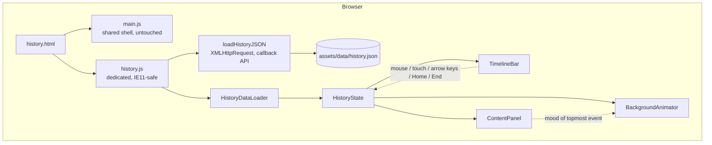
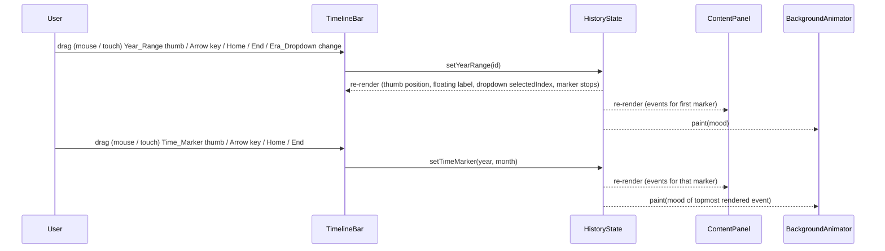

# Design Document

## Overview

The History Timeline Bar turns `history.html` into a content-driven exploration page anchored by a horizontally laid out, sticky timeline. Visitors move through Japanese history in two coordinated steps: they slide the **Year_Range_Slider** along the top of the bar to pick a historical period, and the **Time_Marker_Slider** directly beneath it then exposes the year/month points that actually contain events for that period. The Content_Panel below the bar re-renders to show the matching History_Events, and a full-viewport background layer repaints itself with a two-phase mood transition (Phase 1 desaturates the current color to white, Phase 2 sweeps the new mood color from the left edge to the right edge across the viewport).

All copy, year ranges, and events are loaded from a dedicated `assets/data/history.json` file via a callback-based `XMLHttpRequest` helper (`loadHistoryJSON(path, onSuccess, onError)`) defined inside the dedicated `assets/js/history.js` file. The helper mirrors the cache-busting convention used by the shared `NIPPON.loadJSON` helper in `assets/js/main.js` (it appends `?v=APP_VERSION`) but does not call `NIPPON.loadJSON` itself, so the History_Page does not depend on `fetch` or `async/await` and the shared loader stays untouched and reusable by the rest of the site. Inline HTML and JS hold no Indonesian-language content strings - the data file is the single source of truth so the page can be edited without touching markup or scripts. The shipped `history.json` covers eleven major Japanese historical periods sourced from `assets/data/Rangkuman Sejarah Jepang Berbasis Timeline.pdf` (Zaman Kuno / Yamato through Era Kontemporer) so the page works end-to-end with real content from the first deploy. Authors can still mark individual in-progress entries with `placeholder: true` to surface a "Konten contoh" badge without blocking the rest of the dataset.

The implementation stays inside the project's existing tech envelope - plain HTML, CSS, and vanilla JavaScript with no build step, no framework, and no new runtime dependencies. The History_Page feature is delivered as a self-contained module in two dedicated external files - `assets/js/history.js` and `assets/css/history.css` - authored in **Internet Explorer 11-compatible ECMAScript 5** and IE11-compatible CSS so the project specification's cross-browser target (Google Chrome, Mozilla Firefox, Internet Explorer 11, Opera) is met. The shared files `assets/js/main.js` and `assets/css/style.css`, which maintain the home, quiz, seni, makanan/clothing-culinary, architecture, and art-music pages, are not modified by this feature except to remove History_Page-only code that was previously embedded in them; `NIPPON.loadJSON`, `initNavigation`, and the home-page render functions stay byte-identical. The data loader, state, timeline, content panel, and background animator live as small modules inside `assets/js/history.js`, all `.history-*` styles live in `assets/css/history.css`, and `history.html` loads both files alongside the shared ones via separate `<link>` and `<script>` tags. The two slider controls are custom-built (a native `<input type="range">` cannot give us per-stop labels and a vertical-line thumb) and expose `role="slider"` with the full set of `aria-value*` attributes so assistive technology sees them as standard sliders.

### Design Goals

- Keep the existing site shell (header, footer, nav, brand, fonts, palette) untouched and visually consistent.
- Make the page operable end-to-end with keyboard alone, including arrow-key, Home, and End navigation across both sliders.
- Keep state changes deterministic and small: a single in-memory `selection` object drives everything (slider thumbs, content render, mood, animation).
- Make the background transition read as two distinct beats - "fade to paper, then sweep in the new mood" - rather than a single linear color crossfade.
- Treat reduced-motion users as first-class: the same final visual state, minus the two-phase animation.

### Out of Scope

- Search, filters, or fuzzy matching across events. Selection is strictly two-step (Year_Range -> Time_Marker).
- Server-side rendering or hydration. The page works as a static fetch.
- Persisting the last selection across reloads. Each visit starts from the Default_Year_Range (Yamato).
- Pointer-event drag with momentum/velocity. Drag is straightforward: mouse / touch down on the thumb -> follow the pointer along the track -> snap to the nearest stop on release.

### File layout and module isolation

The History_Page feature is delivered as exactly two new dedicated files plus minimal removals from the two shared site files. Other pages on the site are unaffected.

| File | Status | Role |
|---|---|---|
| `assets/js/main.js` | shared, untouched apart from removals | Site shell. The shared `NIPPON.loadJSON`, `initNavigation`, and home-page render functions stay byte-identical. The History_Page-only code that was previously embedded here (the `HISTORY_*` constants, validators, loader, helpers, state, modules, and the `initHistoryPage` orchestrator) is removed in this iteration so it can move into `assets/js/history.js`. |
| `assets/js/history.js` | new, dedicated | The entire History_Page feature in one file: `loadHistoryJSON` (XHR-based callback API), validation rules, pure helpers (`markersFor`, `eventsAt`, `formatMarkerLabel`, `resolveMood`, `defaultSelection`, `snapToNearest`), `createHistoryState`, `TimelineBar`, `ContentPanel`, `BackgroundAnimator`, and `initHistoryPage`. ES5 / IE11-compatible. Wrapped in a single IIFE; exposes `window.NIPPON_HISTORY` only if needed for tests. No module system, no build step. |
| `assets/css/style.css` | shared, untouched apart from removals | Site shell styles. The History_Page-only `.history-*` rules previously embedded here are removed in this iteration so they can move into `assets/css/history.css`. The `--header-height` custom property declaration in `:root` stays so other pages that read it via `var(--header-height)` keep working. |
| `assets/css/history.css` | new, dedicated | All `.history-*` styles, IE11-safe (no `clip-path`, no `backdrop-filter`, no `isolation: isolate`, no CSS Custom Properties on `:root` for mood values; mood colors are hardcoded on the matching rules). Mobile-first authoring (base rules target ≤599 px, `@media (min-width: 600px)` adds tablet, `@media (min-width: 960px)` adds desktop). |

`history.html` loads all four files as separate external `<link>` and `<script>` tags, in this order:

```html
<link rel="stylesheet" href="assets/css/style.css?v=APP_VERSION">
<link rel="stylesheet" href="assets/css/history.css?v=APP_VERSION">
...
<script src="assets/js/main.js?v=APP_VERSION"></script>
<script src="assets/js/history.js?v=APP_VERSION"></script>
```

Other pages of the site (`index.html`, `quiz.html`, `clothing-culinary.html`, `architecture.html`, `art-music.html`, and any non-History_Page pages) load only `assets/css/style.css` and `assets/js/main.js`; they do not load `assets/js/history.js` or `assets/css/history.css`. This satisfies Requirement 9 acceptance criteria 1 - 5.

### Cross-browser support

The History_Page feature is designed for the four browsers named by the project specification: **Google Chrome**, **Mozilla Firefox**, **Internet Explorer 11**, and **Opera**. IE11 is the most constrained target, and the following implementation choices in this design document are motivated specifically by IE11 compatibility:

- `XMLHttpRequest` instead of `fetch` (Req 9.8); callback-style API instead of `Promise` chains or `async`/`await`.
- ECMAScript 5 syntax instead of ES2015+: `var` only, function declarations / expressions instead of arrow functions, string concatenation with `+` instead of template literals, `for (var i = 0; i < n; i++)` instead of `for...of`, no destructuring, no spread/rest, no default parameters, no ES6 classes (Reqs 9.6, 9.7).
- `position: fixed` plus a sibling `.history-timeline-spacer` element instead of `position: sticky` for the Timeline_Bar (Req 9.11).
- Hardcoded hex color values on each `.history-bg-layer[data-mood="..."]` rule instead of `var(--mood-*)` references; CSS Custom Properties are not implemented in IE11 (Req 9.10).
- A CSS `width` transition (0 → 100%) on the Phase 2 layer instead of animating `clip-path: inset(...)`; IE11 does not support `clip-path` (Reqs 9.12, 9.13).
- No `backdrop-filter` and no `isolation: isolate` anywhere in `assets/css/history.css`; layer stacking is managed by `z-index` only (Req 9.13).
- Mouse events (`mousedown`, `mousemove`, `mouseup`) plus touch events (`touchstart`, `touchmove`, `touchend`) instead of the Pointer Events API (Req 9.9). IE11 ships an early prefixed Pointer Events implementation that does not match the modern spec, so the design avoids the API entirely.
- IE11-supported DOM APIs only: `Array.prototype.indexOf`, `Array.prototype.forEach`, `Object.keys`, `el.classList` (single-argument `add` / `remove` / `contains`; not `el.classList.toggle(name, force)`, whose `force` argument IE11 ignores - the design uses an explicit conditional `add` / `remove` instead), `el.dataset`, `el.addEventListener`. APIs not used unless polyfilled: `Array.from`, `Array.prototype.includes`, `Array.prototype.find`, `Array.prototype.findIndex`, `Object.assign`, `Object.entries`.

Chrome, Firefox, and Opera are strictly more permissive than IE11 along every one of these axes, so a design that works in IE11 works in those browsers as well. Reduced-motion handling continues to use `window.matchMedia('(prefers-reduced-motion: reduce)')`, which IE11 supports for the documented media query (with a defensive guard for the case where `matchMedia` itself is missing).

## Architecture

### High-Level Component Map



### Module Responsibilities

The History_Page adds five small JS modules - all of them inside the dedicated `assets/js/history.js` (not in `assets/js/main.js`). Each has a narrow responsibility and communicates only through the shared `HistoryState` object.

| Module | Responsibility |
|---|---|
| `HistoryDataLoader` | Calls `loadHistoryJSON('assets/data/history.json', onSuccess, onError)` (an XHR-based, callback-style helper defined in the same file) and validates the parsed payload. Drops events whose `month` is invalid (logs a warning) and rejects events whose required fields are missing. Returns a normalized `HistoryData` object via the success callback or surfaces an `Error`-like object via the error callback. |
| `HistoryState` | Holds the `selection` (active `yearRangeId`, active `(year, month\|null)` Time_Marker, current Mood). Exposes `setYearRange(id)`, `setTimeMarker(year, month)`, and a `subscribe(listener)` API. Treats redundant transitions as no-ops so listeners can deduplicate work. |
| `TimelineBar` | Renders the two stacked sliders (Year_Range_Slider on top, Time_Marker_Slider beneath) plus the Era_Dropdown (`<select data-history-era-select>`). Owns the slider DOM, the thumb-attached floating label, the per-stop tick marks, the mouse-and-touch-based drag-to-snap logic, the keyboard navigation (ArrowLeft/Right, Home, End), and the dropdown's `change` handler and `selectedIndex` re-sync. |
| `ContentPanel` | Renders the matching events for the current Time_Marker, the empty state, the loading placeholder, and the `aria-live` announcement region. Sources every visible string from `HistoryData.page`. |
| `BackgroundAnimator` | Paints a full-viewport background keyed on Mood. Runs a two-phase transition: Phase 1 desaturates the current layer toward white over 35-45% of the Medium_Pace duration, Phase 2 sweeps the new mood color left-to-right across the viewport over the remaining 55-65% by transitioning the `--phase2` layer's CSS `width` from `0` to `100%`. Honors `prefers-reduced-motion`. |

#### JavaScript style for `assets/js/history.js`

The whole file is wrapped in a single IIFE and authored in ECMAScript 5 syntax compatible with Internet Explorer 11. The style rules below apply uniformly to every module above:

- `var` only; never `let` or `const`.
- Function declarations and function expressions only; no arrow functions.
- String concatenation with `+`; no template literals.
- Explicit `for (var i = 0; i < n; i++)` loops; no `for...of`.
- No destructuring, spread, rest, default parameters, async/await, ES6 classes, or `Promise` chains in user code.
- IE11-supported APIs only: `Array.prototype.indexOf`, `Array.prototype.forEach`, `Object.keys`, `el.classList.add` / `remove` / `contains` (single-argument), `el.dataset`, `el.addEventListener`. Where a "toggle" is needed, the implementation uses an explicit `if (cond) el.classList.add(name); else el.classList.remove(name);` because IE11's `el.classList.toggle(name, force)` ignores the second argument.
- The IIFE optionally exposes `window.NIPPON_HISTORY = { /* ... */ }` for tests; production code paths do not depend on globals beyond `document`, `window`, and `XMLHttpRequest`.

### Render Flow



### State Model

`HistoryState` keeps a single object:

```text
{
  data: HistoryData | null,
  status: 'idle' | 'loading' | 'ready' | 'error',
  error: string | null,
  selection: {
    yearRangeId: string | null,
    year: integer | null,
    month: integer | null   // null when the marker is year-only
  },
  mood: Mood | null
}
```

State transitions:

- `loadStart` -> `status = 'loading'`. ContentPanel shows the loading placeholder.
- `loadSuccess(data)` -> `status = 'ready'`, `data = data`, `selection = defaultSelection(data)`, `mood = moodOf(selection)`.
- `loadFailure(message)` -> `status = 'error'`, `error = message`. ContentPanel shows the `.error-state` block.
- `setYearRange(id)` -> updates `yearRangeId`; if the new range has at least one Time_Marker, sets `(year, month)` to the first one and recomputes `mood`. Otherwise clears `(year, month)` and sets `mood` to the Year_Range's own `mood`. No-op when `id` already matches.
- `setTimeMarker(year, month)` -> updates `(year, month)` and recomputes `mood`. No-op when both already match.

Listeners are notified after each non-no-op transition. The TimelineBar, ContentPanel, and BackgroundAnimator each register one listener and re-render only the parts of the DOM they own.

## Components and Interfaces

### `assets/data/history.json`

Top-level shape (full schema in [Data Models](#data-models)):

```text
{
  page: { eyebrow, title, intro, emptyStateTitle, emptyStateBody,
          loadErrorMessage, loadingMessage, placeholderBadge,
          selectionAnnouncementTemplate, monthNames[12] },
  defaultYearRangeId: 'yamato',
  yearRanges: YearRange[],   // 11 periods, file order = chronological order
  events: HistoryEvent[]
}
```

`page.monthNames` is an array of twelve Indonesian month names ("Januari" .. "Desember") indexed by `month - 1`. Putting these in the data file keeps the rule "no Indonesian strings in HTML or JS literals" intact, and makes the page localizable later by swapping the file.

`page.selectionAnnouncementTemplate` is a template string with placeholders `{yearRange}`, `{year}`, and `{month}`. The ContentPanel substitutes them when the selection changes (e.g., `"Era {yearRange}, {month} {year}"`). When `month` is null, the substitution drops the leading `, {month}` segment.

The shipped file's `defaultYearRangeId` is the id mapped to **Zaman Kuno / Yamato** (the earliest period, req 6.6). The eleven `yearRanges` are listed in chronological order so that `yearRanges[0]` is also Yamato, which doubles as the implicit default if `defaultYearRangeId` is ever removed or mistyped.

### `history.html`

Replaces the existing `.page-placeholder` block with a `<main>` that hosts the timeline (now `position: fixed`), a spacer that occupies the bar's normal-flow height, and the content/background regions in a stacking order from back to front:

```html
<main id="main-content" class="history-page" data-history-root>
  <div class="history-bg" data-history-bg aria-hidden="true">
    <div class="history-bg-layer history-bg-layer--from"></div>
    <div class="history-bg-layer history-bg-layer--phase1" data-phase="desaturate"></div>
    <div class="history-bg-layer history-bg-layer--phase2" data-phase="sweep"></div>
  </div>

  <section class="history-timeline" aria-label="Linimasa sejarah" data-history-timeline>
    <div class="container">
      <div class="history-slider history-slider--years"
           data-slider="year-range"
           data-history-year-range-slider>
        <div class="history-slider-track" data-slider-track></div>
        <div class="history-slider-stops" data-slider-stops aria-hidden="true"></div>
        <div class="history-slider-thumb"
             role="slider"
             tabindex="0"
             aria-label="Periode sejarah Jepang"
             aria-valuemin="0"
             data-slider-thumb>
          <span class="history-slider-thumb-line" aria-hidden="true"></span>
          <span class="history-slider-thumb-label" data-slider-thumb-label></span>
        </div>

        <label class="history-era-dropdown" data-history-era-dropdown>
          <span class="history-era-dropdown-label">Periode</span>
          <select data-history-era-select>
            <!-- one <option value="<id>">{label}</option> per Year_Range, generated by TimelineBar -->
          </select>
        </label>
      </div>

      <div class="history-slider history-slider--markers"
           data-slider="time-marker"
           data-history-time-marker-slider>
        <div class="history-slider-track" data-slider-track></div>
        <div class="history-slider-stops" data-slider-stops aria-hidden="true"></div>
        <div class="history-slider-thumb history-slider-thumb--line"
             role="slider"
             tabindex="0"
             aria-label="Tanda waktu peristiwa"
             aria-valuemin="0"
             data-slider-thumb>
          <span class="history-slider-thumb-line" aria-hidden="true"></span>
        </div>
      </div>
    </div>
  </section>

  <div class="history-timeline-spacer" data-history-timeline-spacer aria-hidden="true"></div>

  <section class="history-content container" data-history-content>
    <header class="history-content-head">
      <span class="eyebrow" data-history-eyebrow></span>
      <h1 class="page-placeholder-title" data-history-title></h1>
      <p class="lead" data-history-intro></p>
    </header>
    <div class="history-content-events" data-history-events></div>
    <p class="history-live" aria-live="polite" data-history-live></p>
  </section>
</main>
```

`<body data-page="history">` is set so the existing `initNavigation()` (in the untouched `assets/js/main.js`) keeps highlighting the History link. The `<head>` references both stylesheets in the documented order and the `<body>` references both scripts:

```html
<link rel="stylesheet" href="assets/css/style.css?v=APP_VERSION">
<link rel="stylesheet" href="assets/css/history.css?v=APP_VERSION">
...
<script src="assets/js/main.js?v=APP_VERSION"></script>
<script src="assets/js/history.js?v=APP_VERSION"></script>
```

The cache-busting query strings on all four references are bumped to the same `APP_VERSION` value and the same value is set in the `APP_VERSION` constant inside `main.js`. `assets/js/history.js` reads its own `APP_VERSION` constant, declared at the top of the file, and asserts (in tests) that it matches the value used in `history.html`.

The `.history-timeline-spacer` element exists because `assets/css/history.css` positions the bar with `position: fixed` (per Req 9.11) instead of `position: sticky`. When the bar leaves normal flow, the spacer takes its place and prevents the Content_Panel from jumping up under the bar. The spacer's `height` is set in JS on initial mount and on `window.resize` to track the bar's actual rendered height across breakpoints (mobile vs. desktop, since the bar is taller on small viewports where the dropdown wraps beneath the slider).

### HistoryDataLoader

Public API (internal to `assets/js/history.js`):

```text
HistoryDataLoader.load(onSuccess, onError)
  // delegates to loadHistoryJSON('assets/data/history.json', ...)
  // and runs the documented validation/normalization on the parsed payload
  // before invoking onSuccess(data) or onError(err).
```

The loader is built on a small, callback-style `XMLHttpRequest` helper defined in the same file (Req 9.8). The shared `NIPPON.loadJSON` in `assets/js/main.js` is **not** called from the History_Page; this helper is a deliberate stand-alone re-implementation that mirrors `NIPPON.loadJSON`'s `?v=APP_VERSION` cache-busting convention so the History_Page does not depend on the shared `Promise`-and-`fetch`-based loader and the rest of the site keeps using `NIPPON.loadJSON` byte-identically.

```text
function loadHistoryJSON(path, onSuccess, onError) {
  // 1. Build the URL: append "?v=" + APP_VERSION so the browser cache is busted on each version bump.
  // 2. var xhr = new XMLHttpRequest(); xhr.open('GET', urlWithVersion, true);
  // 3. xhr.onreadystatechange = function () {
  //      if (xhr.readyState !== 4) return;
  //      if (xhr.status >= 200 && xhr.status < 300) {
  //        try {
  //          var raw = JSON.parse(xhr.responseText);
  //          var normalized = validateAndNormalize(raw);   // see Validation rules below
  //          onSuccess(normalized);
  //        } catch (e) {
  //          onError(e);
  //        }
  //      } else {
  //        onError(new Error('HTTP ' + xhr.status + ' loading ' + path));
  //      }
  //    };
  // 4. xhr.onerror = function () { onError(new Error('Network error loading ' + path)); };
  // 5. xhr.send();
}
```

The validation and normalization rules carry over verbatim from the previous design and are still documented in [Validation rules applied by `HistoryDataLoader`](#validation-rules-applied-by-historydataloader): events with a `month` field that is not an integer in `[1, 12]` are dropped with a `console.warn` naming the event id, events with a `yearRangeId` that does not match any Year_Range are dropped with a console warning, and `defaultYearRangeId` falls back to `yearRanges[0].id` (with a console warning) when the explicit value does not match any Year_Range. The only thing that changed in this iteration is the *transport* (XHR + callbacks instead of `fetch` + `await`); the validation contract is unchanged.

Because `loadHistoryJSON` is callback-based, the orchestrator's load flow is also callback-based - see [Orchestrator](#orchestrator) below.

### TimelineBar

Public API (internal to `assets/js/history.js`):

```text
TimelineBar.mount(rootEl, state)
TimelineBar.render()
```

The TimelineBar owns two sibling slider components inside `.history-timeline > .container`:

#### Year_Range_Slider (top)

- A horizontal `.history-slider--years` block that spans the full container width from the left edge to the right edge (req 2.2).
- A `.history-slider-track` line drawn across that width, plus a `.history-slider-stops` layer with one `<span>` per Year_Range positioned at `left: i / (N - 1) * 100%` (or `left: 50%` when `N === 1`).
- A single `.history-slider-thumb` element with `role="slider"` and `tabindex="0"`. The thumb owns a vertical indicator line (`.history-slider-thumb-line`) that pokes above the track and a single floating label (`.history-slider-thumb-label`) attached to the thumb that displays the active Year_Range's `label` and `from`-`to` span (e.g., `"Heian, 794 - 1185"`). The label moves with the thumb (req 2.4); per-stop labels are not rendered, only the small tick marks under the track.
- Thumb position: `transform: translateX(<i / (N - 1) * trackWidth>px)` updated whenever the active Year_Range index changes. On render, the thumb's `aria-valuemin = 0`, `aria-valuemax = N - 1`, `aria-valuenow = activeIndex`, `aria-valuetext = "<label>, <from> - <to>"` (req 8.1).
- Click on the track or on a stop tick: snap to that stop index, dispatch `state.setYearRange(stops[i].id)`.
- Mouse drag on the thumb (Req 9.9 - mouse + touch only, no Pointer Events):
  - `mousedown` on the thumb: call `event.preventDefault()`, set `dragging = true`, capture `trackLeft = track.getBoundingClientRect().left` and `trackWidth = track.getBoundingClientRect().width`, attach `mousemove` and `mouseup` listeners on `document` (so the drag continues even if the cursor leaves the thumb).
  - `mousemove` while `dragging`: clamp `event.clientX - trackLeft` to `[0, trackWidth]`, update the thumb's visual `transform: translateX(...px)` to follow the cursor along the track. No state mutation yet - the live drag is a visual-only preview.
  - `mouseup` (anywhere on the document): detach the document `mousemove` and `mouseup` listeners, compute `p = pointerX / trackWidth`, dispatch `state.setYearRange(stops[snapToNearest(positions, p)].id)` so the slider settles on the nearest Year_Range stop (req 2.6).
- Touch drag on the thumb (parallel to the mouse drag):
  - `touchstart` on the thumb: read `event.touches[0].clientX` for `pointerX`, otherwise behave exactly like `mousedown` (capture `trackLeft`/`trackWidth`, mark `dragging = true`, attach `touchmove`/`touchend` listeners on `document`). Do **not** call `event.preventDefault()` here so the browser can still synthesize a click if the user just taps.
  - `touchmove` while `dragging`: read `event.touches[0].clientX`, update the thumb's `transform`, and call `event.preventDefault()` so the page does not scroll under the drag.
  - `touchend` / `touchcancel`: read `event.changedTouches[0].clientX` for the final `pointerX`, detach the document listeners, and dispatch `state.setYearRange(stops[snapToNearest(positions, pointerX / trackWidth)].id)`.
- The Pointer Events API (`pointerdown` / `pointermove` / `pointerup`) is intentionally not used (Req 9.9).
- Keyboard:
  - ArrowLeft -> `setYearRange(stops[max(0, i - 1)].id)` (clamps at first stop, no wrap; req 8.5).
  - ArrowRight -> `setYearRange(stops[min(N - 1, i + 1)].id)` (clamps at last stop).
  - Home -> `setYearRange(stops[0].id)` (req 8.7).
  - End -> `setYearRange(stops[N - 1].id)` (req 8.7).

##### Era_Dropdown (paired with the Year_Range_Slider)

To satisfy the project specification's required "Dropdown" minimum feature on the History_Page (Reqs 9.15, 9.16), the Year_Range_Slider is paired with a small native `<select>` element labeled "Periode":

```html
<label class="history-era-dropdown" data-history-era-dropdown>
  <span class="history-era-dropdown-label">Periode</span>
  <select data-history-era-select>
    <option value="yamato">Zaman Kuno / Yamato</option>
    <option value="asuka">Periode Asuka</option>
    ...
  </select>
</label>
```

- The `<option>` list is generated by `TimelineBar` from `data.yearRanges` so it stays one-to-one with the Year_Range_Slider's discrete stops in the same order.
- On `change`: `setYearRange(event.target.value)`. The same `state.setYearRange(id)` transition is used as for the slider, so the rest of the page (slider thumb, marker stops, content panel, background animator) updates exactly the same way.
- On every state update: the `<select>`'s `selectedIndex` is re-synced to the index of the active Year_Range so dragging the slider, pressing arrow keys, and choosing a dropdown option all stay in sync.
- The dropdown intentionally uses the platform's native `<select>` so it works without any framework, is keyboard-accessible by default, and is rendered correctly by all four target browsers including IE11.
- On viewports ≥600 px the dropdown is rendered to the right of the Year_Range_Slider thumb (or above the slider, whichever fits the breakpoint best). On viewports ≤599 px the dropdown is rendered inline with the floating label of the slider thumb so all interactive elements stay reachable without horizontal page scroll (Req 9.14).

#### Time_Marker_Slider (bottom)

- A `.history-slider--markers` block whose track is intentionally **shorter in width** than the Year_Range_Slider's track (about 70% of the container width, centered) and **narrower in height** (req 3.1). The reduced width keeps the marker slider visually subordinate to the era slider above it.
- Same internal structure (`-track`, `-stops`, `-thumb`) but the thumb carries the modifier class `.history-slider-thumb--line` and CSS that renders the thumb as a thin vertical line (e.g., `width: 2px; height: 1.6rem; border-radius: 0`) rather than a circle (req 3.2). The thumb does **not** carry a floating label - only the active marker's label is shown, but it is rendered inside the marker's nearest stop tick rather than attached to the thumb, so it does not collide with the era label above.
- Stops are computed from `markersFor(activeYearRangeId, data)` (the deduplicated, sorted list of `(year, month | null)` pairs derived from events whose `yearRangeId` matches the active Year_Range, sorted ascending by year, then by month with `null` sorting before any numeric month).
- Stop labels use `formatMarkerLabel(year, month, monthNames)` so a stop with `month` reads e.g. `"Maret 1185"` and a year-only stop reads `"1185"` (req 3.5).
- When the active Year_Range has zero markers, the slider renders an empty track with no thumb position and `aria-valuemax = 0`; the thumb's `aria-valuetext` is the empty string and visually the thumb is hidden (req 3.9).
- When the active Year_Range changes and the new range has at least one marker, the slider auto-selects the first marker (req 3.8); when it changes back to a range whose active marker is unchanged (the user re-activates the already-active Year_Range) the slider keeps its current stops and selection (req 3.7) - this falls out of `setYearRange` being a no-op for redundant ids.
- ARIA values mirror the era slider: `role="slider"`, `aria-valuemin = 0`, `aria-valuemax = M - 1` (where `M = markersFor(...).length`), `aria-valuenow = activeMarkerIndex`, `aria-valuetext = formatMarkerLabel(...)` (req 8.2).
- Click, mouse drag, touch drag, and keyboard interactions follow the same shape as the era slider, scoped to the marker slider's stops list. Mouse and touch use the same `mousedown`/`mousemove`/`mouseup` and `touchstart`/`touchmove`/`touchend` pattern documented above for the Year_Range_Slider; the final dispatch is `state.setTimeMarker(year, month)` instead of `state.setYearRange(id)`. Pointer Events are not used here either (Req 9.9).

#### Shared slider helpers

The two sliders share a single internal helper:

```text
snapToNearest(positions: number[], p: number): number
  // positions are normalized [0, 1] stop positions, p is the release position in [0, 1]
  // returns the index of the stop with minimum |positions[i] - p|
  // ties break toward the lower index for determinism
```

For evenly distributed stops the result simplifies to `Math.round((N - 1) * p)`, but the helper accepts any `positions` array so future non-uniform distributions (e.g., year-weighted stops) can plug in without changing the call sites.

The mouse-drag, touch-drag, click, and keyboard handlers funnel through one private function per slider that reads the current state, computes the new index, and calls `state.setYearRange` or `state.setTimeMarker`. Activation and focus stay synchronized: after every navigation the corresponding thumb is the focused element and `aria-valuenow` is updated.

Single-focusable-thumb invariant (req 8.9): each slider exposes exactly one element with `tabindex="0"` (the thumb). Tick marks, the track, and the label are decorative and carry `aria-hidden="true"`; the per-stop tick `<span>`s have no `tabindex` and are not in the tab order. Tab navigation visits the era thumb, then the marker thumb, then continues into the content panel.

### ContentPanel

Public API:

```text
ContentPanel.mount(rootEl, state)
ContentPanel.render()
```

Renders three regions:

- The static head (`eyebrow`, `title`, `intro`) populated once from `data.page` after load.
- The events list (`data-history-events`), re-rendered on every state change.
- The live region (`data-history-live`), updated only when the active selection actually changes.

Event rendering:

```html
<article class="history-event" data-mood="<mood>">
  <header class="history-event-head">
    <span class="history-event-when">Maret 1185</span>
    <span class="history-event-badge" hidden>Konten contoh</span>
    <h2 class="history-event-title">{title}</h2>
  </header>
  <p class="history-event-body">{body}</p>
  <figure class="history-event-figure" hidden>
    
  </figure>
</article>
```

The `Konten contoh` badge is the `page.placeholderBadge` string; it is shown only when `event.placeholder === true` (req 6.5). The figure is rendered only when the event has an `image`. The `alt` text is `event.alt` when present, else the empty string (decorative).

Empty state (zero matches): renders a `<div class="history-empty">` with `page.emptyStateTitle` as a heading and `page.emptyStateBody` as a paragraph.

Loading state (req 4.5): renders a `<div class="history-loading">` with `page.loadingMessage`, replaced by either the events list, the empty state, or the error state once the load resolves.

Error state (req 1.8): renders the existing `.error-state` block with `page.loadErrorMessage`. If the file itself was unreadable (so `data.page` does not exist), a built-in fallback string `"Konten sejarah belum dapat dimuat. Pastikan situs dijalankan lewat server lokal."` is used. This fallback is the single string allowed in JS, and is mirrored verbatim in a constant at the top of the history module so it is searchable.

Live-region: when the `(yearRangeId, year, month)` triple changes, the panel substitutes `page.selectionAnnouncementTemplate` with `{yearRange}` -> active Year_Range label, `{year}` -> active year, `{month}` -> `monthNames[month-1]` (with the leading `, {month}` segment stripped when the marker is year-only). Identical successive selections produce no announcement (req 8.4).

### BackgroundAnimator

Public API:

```text
BackgroundAnimator.mount(rootEl, state)
BackgroundAnimator.paint(mood)
```

The animator owns three stacked layers inside `.history-bg`:

- `.history-bg-layer--from` holds the *previously* applied mood color and stays full-height as the visible base.
- `.history-bg-layer--phase1` is a white (or near-white, paper-toned) overlay that fades in on top of the `--from` layer during Phase 1 to create the desaturation-toward-white effect.
- `.history-bg-layer--phase2` holds the *next* mood color in a layer that is anchored to the left edge of the viewport with `width: 0` at rest. During Phase 2 a CSS `width` transition grows the layer from `0` to `100%`, which produces the same visual effect as a left-to-right `clip-path` reveal but works in Internet Explorer 11 (Req 9.12). Internet Explorer 11 does not support `clip-path`, which is why the implementation animates `width` instead.

#### Two-phase choreography (reqs 5.2, 5.3, 5.5)

```text
total = clamp(1200ms ± 100ms, 1100..1300)   // Medium_Pace
phase1 = round(total * 0.40)                // 0.40 ∈ [0.35, 0.45]
phase2 = total - phase1                     // ∈ [0.55, 0.65] of total

t = 0          : start
                 - phase1 layer's opacity transitions from 0 to 1 over `phase1` ms
                 - phase2 layer is invisible (width: 0)
                 - new-mood color is NOT visible anywhere on screen
t = phase1     : phase1 layer reaches opacity 1 (viewport is white/near-white)
                 - phase2 layer's data-mood is set to the new mood
                 - phase2 layer's width transitions from 0 to 100% over `phase2` ms
                   (CSS transition, left-to-right reveal because the layer is left-anchored)
t = total      : phase2 layer fully covers the viewport with the new mood color
                 - copy new mood onto --from layer (data-mood = newMood)
                 - reset --phase1 (opacity 0) and --phase2 (width 0) for next paint
```

The choreography is driven by two CSS transitions plus a single `setTimeout(..., phase1)` to start Phase 2 and a `setTimeout(..., total)` (or a `transitionend` listener) to commit the result. Both timers are cancelled if `paint(mood)` is called again mid-flight (see Concurrency below).

The actual `total` constant in code is `1200` ms with `phase1 = 480` ms (40%) and `phase2 = 720` ms (60%). The 1100-1300 ms requirement window allows downstream tuning without breaking property tests; the property assertion is on the documented bounds, not on the exact value.

#### Mood-to-color mapping (req 5.1)

Mood colors are written as **hardcoded hex values** on each `.history-bg-layer[data-mood="..."]` rule because Internet Explorer 11 does not implement CSS Custom Properties (Req 9.10). The custom-property names are kept in a leading comment for designers and for future browsers, but they are **not** declared on `:root` in `assets/css/history.css` and are **not** used via `var()` in any rule:

```css
/*
 * Mood color palette. The CSS Custom Property names below are kept as
 * documentation for designers and for future browsers; they are NOT used
 * via var() in the rules that follow because Internet Explorer 11 does
 * not implement CSS Custom Properties.
 *
 *   --mood-dark:     #11243f
 *   --mood-positive: #e8c98a
 *   --mood-negative: #7a2b22
 *   --mood-sacred:   #f6ecc9
 *   --mood-casual:   #d8c8a4
 */
.history-bg-layer[data-mood="dark"]     { background: #11243f; }
.history-bg-layer[data-mood="positive"] { background: #e8c98a; }
.history-bg-layer[data-mood="negative"] { background: #7a2b22; }
.history-bg-layer[data-mood="sacred"]   { background: #f6ecc9; }
.history-bg-layer[data-mood="casual"]   { background: #d8c8a4; }
```

`assets/css/history.css` does **not** define `--mood-dark` / `--mood-positive` / `--mood-negative` / `--mood-sacred` / `--mood-casual` on `:root`. The shared `assets/css/style.css` continues to declare its own `:root` custom properties (e.g., `--header-height`, `--paper`, `--ink`) for the rest of the site, and those are not affected by this design.

#### Phase 1 implementation

Phase 1 desaturates the currently-displayed mood toward white. The implementation is the white overlay: the `--phase1` layer has `background: #ffffff` (a strict "white" hex; the previously-used `var(--paper)` reference cannot be relied on in IE11), `opacity: 0` at rest, and a CSS transition `opacity 480ms ease-out`. When Phase 1 starts, the JS sets `data-state="active"` on the layer, the CSS sets `opacity: 1`, and the visible result is the previous mood color fading to white. IE11 supports `opacity` transitions natively, so this implementation is kept unchanged across all four target browsers (Chrome, Firefox, IE11, Opera).

The alternative implementation (`filter: saturate(...)` animated from `1` to `0` on the `--from` layer) is not used: IE11 does not support CSS `filter`. The white-overlay approach is therefore the only IE11-compatible Phase 1 implementation we ship.

#### Phase 2 implementation

Phase 2 sweeps the new mood color from the left edge to the right edge by transitioning the `--phase2` layer's `width` from `0` to `100%` (Req 9.12). Internet Explorer 11 does not support `clip-path`, which is why the implementation animates `width` instead:

```css
.history-bg-layer--phase2 {
  position: absolute;
  top: 0;
  left: 0;
  bottom: 0;
  width: 0;
  overflow: hidden;
  transition: width 720ms cubic-bezier(0.4, 0, 0.2, 1);
}
.history-bg-layer--phase2[data-state="sweeping"] {
  width: 100%;
}
```

The inner background-color of the `--phase2` layer is the *new* mood color (set on the same element via `data-mood="<mood>"`, which the rules in [Mood-to-color mapping](#mood-to-color-mapping-req-51) match). As the layer's `width` grows from `0` to `100%`, the new mood color fills in from the left edge to the right edge of the viewport. This is observably equivalent to the `clip-path: inset(0 100% 0 0)` → `inset(0 0 0 0)` formulation in the requirements text but it works in IE11. At `t = phase1` the layer has `width: 0` so no portion of the new mood color is visible. At `t = phase1 + (phase2 / 2)` the layer covers the left half of the viewport. At `t = total` the layer covers the full viewport - this is the same monotonic left-to-right reveal that the original `clip-path` formulation produced.

`overflow: hidden` keeps the colored content clipped to the layer's animated `width`. Internet Explorer 11 supports `width` transitions on absolutely-positioned elements with `overflow: hidden`, so the sweep is consistent across all four target browsers (Chrome, Firefox, IE11, Opera).

Optional polish (not required): the leading edge can be feathered with a CSS `linear-gradient` background on the layer so the boundary reads as a soft sweep rather than a hard vertical line. The property test only requires monotonic left-to-right coverage.

#### Concurrency (req 5.6)

Each `paint(mood)` call:

1. Reads `state.mood` directly (no need to diff against `currentMood` if we are entering the function from a state-change subscription).
2. If the requested mood equals `currentMood`, no-op.
3. Otherwise, cancels the in-flight `setTimeout` for Phase 2 start and the `setTimeout` for completion, removes any pending `transitionend` listener.
4. Re-targets the `--phase2` layer's `data-mood` to the latest mood.
5. If Phase 1 is still in flight, lets Phase 1 continue (the white overlay is mood-agnostic, so re-targeting only the `--phase2` layer is safe).
6. If Phase 2 has already started, lets it continue toward the new mood (the `width` transition is mood-agnostic; only the layer's `data-mood` color was re-targeted).
7. The `setTimeout(commit, total - elapsed)` is restarted so the final commit happens at the original total deadline (no compounding).

The net effect: after the most recent `paint(mood)` call has had time to settle, the visible background equals the most recent requested mood, and each completed transition's measured total duration is in `[1100, 1300]` ms (req 5.4). This is the convergence property tested by Property 13 below.

#### Active-mood resolution (req 5.7)

The BackgroundAnimator is told which mood to paint by the orchestrator, which computes:

1. If the ContentPanel renders one or more events, `mood = events[0].mood` (the topmost event in document order, which equals the first matching event by ascending `id`).
2. Otherwise, `mood = activeYearRange.mood`.

This is implemented by the `resolveMood(events, yearRange)` pure helper (Property 10).

#### Reduced motion (req 5.8)

When `window.matchMedia('(prefers-reduced-motion: reduce)').matches` is `true`, `paint(mood)` writes the new mood directly to the `--from` layer synchronously and resets both `--phase1` and `--phase2` layers; neither phase runs. The page never gets stuck mid-transition.

### Stacking and fixed positioning (reqs 2.1, 7.6, Req 9.11, Req 9.13)

Layer stacking is managed using `z-index` only - **no `isolation: isolate`** anywhere in `assets/css/history.css` (Req 9.13). The page wrapper `.history-page` has `position: relative;` to anchor absolutely-positioned bg layers, but does **not** declare `isolation: isolate`. The stacking order from back to front is:

| Layer | z-index | Notes |
|---|---|---|
| `.history-bg` | `0` | absolutely-positioned container behind everything |
| `.history-bg-layer--from` | `1` | inside `.history-bg`; visible base |
| `.history-bg-layer--phase1` | `2` | inside `.history-bg`; white overlay |
| `.history-bg-layer--phase2` | `3` | inside `.history-bg`; new-mood overlay (width-anchored) |
| `.history-content` | `10` | above the background |
| `.history-timeline-spacer` | `auto` | participates in normal flow only; no stacking concerns |
| `.history-timeline` | `50` | fixed bar, just below the site header |
| `.site-header` | `90` | declared in shared `assets/css/style.css`; unchanged |

The `.history-timeline` rule is `position: fixed; top: 76px; left: 0; right: 0; z-index: 50;` (Reqs 2.1, 9.11). The `76px` value is the same number that the shared `assets/css/style.css` declares as `--header-height` on `:root`; it is hardcoded here because Internet Explorer 11 does not support CSS Custom Properties (Req 9.10). A comment on the rule names the variable for traceability so designers know to update both files when the shared header height changes:

```css
.history-timeline {
  /* top must equal --header-height declared in assets/css/style.css. */
  position: fixed;
  top: 76px;
  left: 0;
  right: 0;
  z-index: 50;
}
```

Because the bar is `position: fixed`, a sibling `.history-timeline-spacer` element is rendered immediately after the `.history-timeline` element inside `<main class="history-page">`. Its `height` is set in `assets/js/history.js` on initial mount and on every `window.resize` event so it tracks the bar's actual rendered height across breakpoints. The spacer keeps the Content_Panel from jumping under the bar when the bar leaves normal flow. The user-visible behavior contract from the requirements text - the bar staying anchored at the top of the viewport while the user scrolls the Content_Panel - is preserved; the design just implements that contract via `position: fixed` + spacer instead of `position: sticky` so it works in IE11.

The absence of `isolation: isolate` is acceptable because the bg layers are inside the `.history-page` `<main>` element, **not** inside the existing `.site-header` stacking context. Without a CSS-imposed isolation, the `z-index` values listed above are still ordered correctly relative to `.site-header`'s `z-index: 90`, so the bg layers cannot escape into the header (Req 7.6). Slider thumbs render their `:focus-visible` outline above all bg layers because the slider is inside `.history-timeline` (`z-index: 50`), which sits above the bg in document order.

### Mobile-first CSS

`assets/css/history.css` is authored mobile-first per Req 9.14. Base rules (those declared outside any `@media` block) target viewports up to **599 px** wide; subsequent breakpoints progressively enhance the layout for larger viewports:

| Breakpoint | Media query | Layout adjustments |
|---|---|---|
| Mobile (default) | _(no media query)_ | The Year_Range_Slider track and the Time_Marker_Slider track each fill the container width so all stops remain reachable without horizontal page scroll. The Era_Dropdown is rendered inline with the Year_Range_Slider's floating thumb label so it stays reachable. |
| Tablet | `@media (min-width: 600px)` | The Era_Dropdown moves out from under the floating label and is rendered as a separate control to the right of the slider track. |
| Desktop | `@media (min-width: 960px)` | Slightly larger paddings, bigger typography, and a wider Time_Marker_Slider track (still narrower than the era track per Req 3.1) for better mouse-drag affordance. |

The Time_Marker_Slider is shown beneath the Year_Range_Slider on every viewport size; the two sliders are never collapsed into a single control. On mobile the timeline bar is consequently a little taller (the dropdown wraps under the slider), and the `.history-timeline-spacer` JS-driven height bookkeeping handles the difference automatically.

### Orchestrator

A small `initHistoryPage()` function lives inside `assets/js/history.js` (not `main.js`) and is invoked from a `DOMContentLoaded` handler in `history.js` itself. It is **not** called from `main.js`'s own `DOMContentLoaded` handler so the shared file stays untouched (Req 9.5):

```text
function initHistoryPage() {
  if (document.body.dataset.page !== 'history') return;
  var root = document.querySelector('[data-history-root]');
  if (!root) return;

  var state = createHistoryState();
  TimelineBar.mount(root.querySelector('[data-history-timeline]'), state);
  ContentPanel.mount(root.querySelector('[data-history-content]'), state);
  BackgroundAnimator.mount(root.querySelector('[data-history-bg]'), state);

  state.loadStart();
  loadHistoryJSON(
    'assets/data/history.json',
    function (data) { state.loadSuccess(data); },
    function (err) {
      var message = (err && err.message) ? err.message : HISTORY_LOAD_ERROR_FALLBACK;
      state.loadFailure(message);
      if (typeof console !== 'undefined' && console.error) {
        console.error(err);
      }
    }
  );
}

if (document.readyState === 'loading') {
  document.addEventListener('DOMContentLoaded', initHistoryPage);
} else {
  initHistoryPage();
}
```

The body of `initHistoryPage` uses ES5 syntax exclusively (`var`, function expressions, no destructuring). The function still guards on `document.body.dataset.page === 'history'` so accidentally including `assets/js/history.js` on a non-History_Page would be a no-op. The load is performed by `loadHistoryJSON(path, onSuccess, onError)` (the XHR-based, callback-style helper documented in [HistoryDataLoader](#historydataloader)) instead of `await NIPPON.loadJSON(...)`. The shared `NIPPON.loadJSON` in `assets/js/main.js` is unchanged and continues to serve the rest of the site.

## Data Models

### `history.json` schema

The schema of `assets/data/history.json` is **unchanged** in this iteration - the data layer is browser-agnostic and does not need IE11-specific adjustments. The `placeholder` field on `HistoryEvent` remains, and its semantics (a per-event override that surfaces the "Konten contoh" badge in the Content_Panel) are unchanged. The only addition is an optional, validator-ignored top-level `_source` field carrying the PDF citation (Req 9.19); see [Source citations in file headers](#source-citations-in-file-headers-req-919).

```text
HistoryData := {
  page: PageCopy,
  defaultYearRangeId: string,                // shipped value: 'yamato'
  yearRanges: YearRange[],                   // length === 11 in the shipped file
  events: HistoryEvent[]                      // length >= 1 per shipped Year_Range
}

PageCopy := {
  eyebrow: string,                           // non-empty
  title: string,                             // non-empty
  intro: string,                             // non-empty
  emptyStateTitle: string,                   // non-empty
  emptyStateBody: string,                    // non-empty
  loadErrorMessage: string,                  // non-empty
  loadingMessage: string,                    // non-empty
  placeholderBadge: string,                  // non-empty
  selectionAnnouncementTemplate: string,     // contains {yearRange} and {year}; {month} optional
  monthNames: string[12]                     // Indonesian month names, index 0 = Januari
}

YearRange := {
  id: string,                                // unique within file, kebab-case
  label: string,                             // e.g., "Heian"
  from: integer,                             // year, may be negative for BC eras
  to: integer,                               // >= from
  mood: Mood
}

HistoryEvent := {
  id: string,                                // unique within file
  yearRangeId: string,                       // must reference an existing YearRange.id
  year: integer,                             // from <= year <= to of its YearRange
  month?: integer,                           // 1..12 if present
  title: string,                             // non-empty
  body: string,                              // non-empty
  mood: Mood,
  image?: string,                            // path under assets/images
  alt?: string,                              // image alt text when image is present
  placeholder?: boolean                      // defaults to false
}

Mood := 'dark' | 'positive' | 'negative' | 'sacred' | 'casual'
```

### Shipped Year_Ranges (req 6.1)

The shipped `history.json` ships eleven `yearRanges`, in chronological order, covering each major Japanese historical period documented in `assets/data/Rangkuman Sejarah Jepang Berbasis Timeline.pdf`:

| Index | id | label (Indonesian) | from | to | Notes |
|---|---|---|---|---|---|
| 0 | `yamato` | Zaman Kuno / Yamato | -10000 | 538 | **Default_Year_Range (req 6.6)** |
| 1 | `asuka` | Periode Asuka | 538 | 710 | |
| 2 | `nara` | Periode Nara | 710 | 794 | |
| 3 | `heian` | Periode Heian | 794 | 1185 | |
| 4 | `kamakura` | Periode Kamakura | 1185 | 1333 | |
| 5 | `muromachi-azuchi-momoyama` | Periode Muromachi / Sengoku / Azuchi-Momoyama | 1336 | 1603 | |
| 6 | `edo` | Periode Edo | 1603 | 1868 | |
| 7 | `meiji` | Era Meiji | 1868 | 1912 | |
| 8 | `taisho-showa-awal` | Era Taisho dan Showa Awal | 1912 | 1945 | |
| 9 | `pendudukan-sekutu` | Era Pendudukan Sekutu | 1945 | 1952 | |
| 10 | `kontemporer` | Era Kontemporer | 1989 | 2025 | The file's `to` is the current year at ship time |

`from` for `yamato` is documented as "10,000 SM" in the source PDF; in the JSON it is encoded as a negative integer (`-10000`) so the schema rule `to >= from` continues to hold. The `to` value of `kontemporer` is set to the current year at ship time and is updated as part of the routine content refresh; it is not a fixed sentinel.

### Shipped events (req 6.2)

Each `yearRange` carries at least one event. The shipped events include, at a minimum, the dated entries called out in the requirements:

| Year-Month | Event title (representative) | yearRangeId | Mood guidance |
|---|---|---|---|
| 538 | Pengenalan Buddhisme dari Baekje | `asuka` | sacred (req 6.3) |
| Juli 645 | Reformasi Taika dimulai | `asuka` | casual |
| Maret 794 | Pemindahan ibu kota ke Heian-kyo | `heian` | sacred |
| ~1010 | Penyelesaian Hikayat Genji oleh Murasaki Shikibu | `heian` | positive |
| 1185 | Pertempuran Dan-no-ura dan akhir klan Taira | `heian`/`kamakura` boundary | dark |
| 1274, 1281 | Invasi Mongol dan Kamikaze | `kamakura` | sacred |
| Juni 1582 | Insiden Honnō-ji (pengkhianatan terhadap Oda Nobunaga) | `muromachi-azuchi-momoyama` | negative |
| Agustus 1543 | Kedatangan senjata api Portugis di Tanegashima | `muromachi-azuchi-momoyama` | casual |
| Oktober 1600 | Pertempuran Sekigahara | `muromachi-azuchi-momoyama` | dark |
| Maret 1854 | Perjanjian Kanagawa membuka isolasi | `edo` | negative |
| Januari 1868 | Restorasi Meiji dimulai | `meiji` | positive |
| September 1923 | Gempa Besar Kanto | `taisho-showa-awal` | dark |
| Agustus 1945 | Bom atom Hiroshima dan Nagasaki | `taisho-showa-awal` | dark |
| 1947 | Konstitusi pasifis baru diterapkan | `pendudukan-sekutu` | positive |
| Mei 1989 | Awal era Heisei | `kontemporer` | casual |
| 1990s | Lost Decades dan pecahnya gelembung ekonomi | `kontemporer` | negative |

The dataset is intentionally comprehensive enough to exercise every code path: ranges with multiple distinct months (multiple Time_Markers), ranges with multiple events on the same `(year, month)` pair (one Time_Marker, multiple events), and at least one event with no `month` field (year-only Time_Marker). Every Mood value appears at least once across the dataset so the BackgroundAnimator palette and the Phase 1/Phase 2 transitions are exercised by the smoke test.

The `placeholder: true` flag is reserved for in-progress entries: an author can ship a fresh event with a stub body and `placeholder: true` so reviewers see the "Konten contoh" badge in the Content_Panel until the body is finalized. The shipped real-history events default to `placeholder: false` (or omit the field entirely).

### Validation rules applied by `HistoryDataLoader`

- A missing or non-string field listed as required causes the whole load to throw, which surfaces the error state.
- An event with `month` present but not an integer in `[1, 12]` is dropped from the loaded events list and a `console.warn` is emitted naming the event id (req 1.6). The rest of the file still loads.
- An event whose `yearRangeId` does not match any Year_Range is dropped with a console warning. (Defensive; not strictly required, but keeps the timeline coherent.)
- An event with `month: undefined` (key absent) keeps that absence; the loader does not synthesize a default month. The downstream marker derivation treats absence as "year-only" (req 1.5).
- `defaultYearRangeId`, when present and matching an existing Year_Range, becomes the Default_Year_Range. Otherwise the first Year_Range in the array wins, with a console warning when an explicit value did not match.

### Source citations in file headers (Req 9.19)

The first comment block of each of the three History_Page files cites `assets/data/Rangkuman Sejarah Jepang Berbasis Timeline.pdf` as the source of the Japanese-history narrative content shipped in the dataset. The same convention applies to any other third-party content or code that lands inside the History_Module_Files in the future:

- `assets/js/history.js` opens with a leading comment that names the PDF and acknowledges it as the source of the narrative content surfaced in `assets/data/history.json`.
- `assets/css/history.css` opens with a leading comment that names the PDF for the same reason (since mood values and visual choices are partly informed by the historical periods documented there).
- `assets/data/history.json` is JSON, which does not allow comments, so the citation moves into a top-level `_source` string field on the object (e.g., `"_source": "assets/data/Rangkuman Sejarah Jepang Berbasis Timeline.pdf"`). The loader ignores this field and the validator does not require it.

This satisfies Req 9.19 without polluting the executable code path.

### Derived structures

`yearRangeIndex: Map<id, YearRange>` and `eventsByYearRange: Map<id, HistoryEvent[]>` are computed once after a successful load and reused by every render to avoid re-scanning the events array.

`markersFor(yearRangeId)` returns the deduplicated, sorted list of `{ year, month: integer | null }` derived from `eventsByYearRange[yearRangeId]`. Sort order: ascending by `year`; within a year, `month: null` sorts before any numeric month, then ascending month. This is the exact set rendered as Time_Marker stops (req 3.3).

`eventsAt(yearRangeId, year, month)` returns events whose `(year, month)` matches the marker, sorted ascending by `id` (req 4.2). When `month` is null, the match requires the event also has no month (req 1.5).

`snapToNearest(positions, p)` takes a sorted `positions: number[]` (each in `[0, 1]`) and a release `p: number` (in `[0, 1]`) and returns the index `i` minimizing `|positions[i] - p|`. Ties break toward the lower index. For evenly spaced stops `positions[i] = i / (N - 1)` this collapses to `Math.round((N - 1) * p)`, but the helper is general so future non-uniform layouts work too.


## Correctness Properties

*A property is a characteristic or behavior that should hold true across all valid executions of a system - essentially, a formal statement about what the system should do. Properties serve as the bridge between human-readable specifications and machine-verifiable correctness guarantees.*

The History Timeline Bar has a clear pure-logic core (data validation, marker derivation, event filtering, label formatting, mood resolution, snap-to-nearest, modular keyboard navigation) where input variation reveals real bugs and where 100+ iterations are cheap to run. Property-based testing is the right tool for that core. The slider DOM contracts (single-active-thumb, ARIA semantics, single-focusable-thumb) are also natural property targets because they have to hold across arbitrary interaction sequences. Layout, animation choreography measurements, and one-shot lifecycle behaviors that do not vary with input are covered by example-based tests in [Testing Strategy](#testing-strategy) instead.

After the prework reflection, the testable acceptance criteria collapse into the following 15 properties.

### Property 1: Loader rejects malformed records and accepts well-formed ones

*For any* candidate `HistoryData`-shaped object, the `HistoryDataLoader` either returns a normalized result whose `yearRanges` and `events` all satisfy the documented schema (`yearRange.to >= yearRange.from`, all required fields present and of the expected types, `event.month` either absent or an integer in `[1, 12]`, `event.image` either absent or a string, `event.placeholder` either absent or a boolean), or it throws when a structurally required field is missing.

**Validates: Requirements 1.2, 1.3, 1.4, 6.4**

### Property 2: Loader preserves missing month as missing and drops invalid months with a warning

*For any* candidate event, the loader's behavior on the `month` field is exactly: when the input has no `month` key, the loaded record has no `month` field; when the input has a `month` that is not an integer in `[1, 12]`, the event is excluded from the result and `console.warn` is called with a message containing the event's `id`; when the input has a valid integer `month`, the loaded record carries the same integer.

**Validates: Requirements 1.5, 1.6**

### Property 3: Marker derivation matches a reference implementation

*For any* list of `HistoryEvent` records belonging to a single Year_Range, `markersFor(yearRangeId)` returns the same list of `{ year, month: integer | null }` pairs as a reference implementation that (a) collects each distinct `(year, month|null)` pair (treating absent `month` as `null`), (b) deduplicates them, and (c) sorts ascending by `year`, with `month: null` sorting before any numeric month within the same year, then ascending month. Equivalently: a marker for `(y, m)` exists in the result iff at least one event has `year === y` and `month === m` (with `m === null` matching events that have no `month`), and the result is in canonical sorted order.

**Validates: Requirements 3.3, 3.4, 3.6**

### Property 4: Time_Marker label formatting

*For any* `year` (any integer), `month` (either `null` or an integer in `[1, 12]`), and any 12-element `monthNames` array, the `formatMarkerLabel(year, month, monthNames)` function returns `monthNames[month - 1] + " " + String(year)` when `month` is an integer in `[1, 12]`, and returns `String(year)` when `month` is `null`.

**Validates: Requirements 3.5**

### Property 5: Snap-to-nearest converges to the closest stop

*For any* sorted `positions` array of length `N >= 1` with values in `[0, 1]` and *for any* release `p` in `[0, 1]`, `snapToNearest(positions, p)` returns an index `i` such that `|positions[i] - p|` is the minimum over all indices, with ties broken toward the lower index. Combined with the slider's mouse-drag and touch-drag handlers, this guarantees that any drag release on either slider settles on the nearest discrete stop (req 2.6 for the Year_Range_Slider, req 3.10 for the Time_Marker_Slider).

**Validates: Requirements 2.6, 3.10**

### Property 6: Year_Range_Slider rendering is faithful to the data

*For any* valid `HistoryData`, after `TimelineBar.mount` completes initial render: the Year_Range stop ticks in DOM document order map one-to-one to `data.yearRanges` in array order; the thumb's `aria-valuenow` equals the active Year_Range index; the thumb's floating label text equals `"<label>, <from> - <to>"` for the active Year_Range; the thumb's normalized position (its `left` percentage along the track) equals `activeIndex / (N - 1)` for `N > 1` and `0.5` for `N === 1`; and the active Year_Range equals `data.defaultYearRangeId` when present and matching, else `data.yearRanges[0].id`.

**Validates: Requirements 2.2, 2.3, 2.4, 2.5**

### Property 7: Slider ARIA semantics

*For any* valid data and *for any* interaction sequence, both slider thumbs satisfy: `role === "slider"`, `aria-valuemin === "0"`, `aria-valuemax === String(stopsCount - 1)` (or `"0"` when `stopsCount === 0`), `aria-valuenow === String(activeIndex)` (and updates on every selection change), and `aria-valuetext` equals the formatted label for the active stop (`"<label>, <from> - <to>"` for the era slider, `formatMarkerLabel(year, month, monthNames)` for the marker slider). Each slider has exactly one element with a non-negative `tabindex` (the thumb).

**Validates: Requirements 8.1, 8.2, 8.9**

### Property 8: Single-active-thumb invariant under any interaction sequence

*For any* sequence of TimelineBar interactions (drag releases on either slider, ArrowLeft/ArrowRight/Home/End presses on either thumb), after each step: the Year_Range_Slider has exactly one active stop (its index equals `aria-valuenow`); the Time_Marker_Slider has exactly one active stop when the active Year_Range has at least one Time_Marker, otherwise zero; re-activating the already-active Year_Range does not change which stop is active; switching to a Year_Range that has at least one marker auto-selects the first marker; switching to a Year_Range with zero markers leaves the marker slider with no active thumb.

**Validates: Requirements 3.7, 3.8, 3.9**

### Property 9: Content_Panel render matches the active selection

*For any* sequence of TimelineBar interactions over any valid data, after each step the Content_Panel's rendered DOM matches `eventsAt(activeYearRangeId, activeYear, activeMonth)` exactly: each rendered `<article>` corresponds to one event in ascending-`id` order; the article's heading text equals `event.title`, its body text contains `event.body`, an `` with `alt = event.alt ?? ""` is present iff `event.image` is set, and a placeholder badge with `page.placeholderBadge` text is present iff `event.placeholder === true`. When the filter yields zero events, the Content_Panel renders the empty-state block with `page.emptyStateTitle` and `page.emptyStateBody` and no event articles.

**Validates: Requirements 4.1, 4.2, 4.3, 4.4, 6.5**

### Property 10: Mood resolution

*For any* list of currently-rendered events `events` and any active Year_Range `yr`, `resolveMood(events, yr)` returns `events[0].mood` when `events.length > 0`, and returns `yr.mood` otherwise. Together with Property 9, this fully specifies the active Mood at any moment.

**Validates: Requirements 5.1, 5.7**

### Property 11: Phase 1 desaturates to white before Phase 2 begins

*For any* mood transition where the previous mood differs from the new mood and `prefers-reduced-motion: reduce` is not set, sampling the visible background at any time `t` in `[0, phase1)` shows no portion of the new mood color (the visible color is a blend of the previous mood and white, biased toward white as `t` increases); at time `t === phase1` the visible color is white or near-white; and from that moment Phase 2 begins. The total transition duration `total` lies in `[1100, 1300]` ms and the Phase 1 share `phase1 / total` lies in `[0.35, 0.45]`.

In this iteration the property is sampled via `getComputedStyle` of the `--phase1` overlay's `opacity` (instead of inferring saturation from a paint sample) and via `getComputedStyle` of the `--phase2` overlay's `width` (instead of its `clip-path`); the test asserts `opacity ≈ 1` at `t === phase1` and `width === "0px"` (or equivalent) for all `t < phase1`.

**Validates: Requirements 5.2, 5.4, 5.5**

### Property 12: Phase 2 sweeps the new mood color from left to right

*For any* mood transition where the previous mood differs from the new mood and `prefers-reduced-motion: reduce` is not set, sampling the `--phase2` layer's revealed coverage at any two times `t1 < t2` in `[phase1, total]` yields `coverageRight(t2) >= coverageRight(t1)` (left-to-right monotonic reveal); at `t === phase1` the revealed coverage is `0` (no new color visible); at `t === total` the revealed coverage is `1` (new mood fully covers the viewport).

In this iteration `coverageRight(t)` is computed from the `--phase2` overlay's CSS `width` (read via `getComputedStyle`), not its `clip-path`; the relationship is `coverageRight(t) = parseFloat(width) / viewportWidth`. The behavioral content of the property is unchanged.

**Validates: Requirements 5.3**

### Property 13: Background_Animator converges to the most recent Mood

*For any* sequence of `paint(mood)` calls (with arbitrary delays, including delays smaller than `Medium_Pace`), after the last call has had time to settle (or instantly when `prefers-reduced-motion: reduce`), the visible background color equals the CSS variable mapped to the *last* `mood` in the sequence. Each individual completed transition's measured total duration is within `[1100, 1300]` ms.

**Validates: Requirements 5.4, 5.6**

### Property 14: Live-region announcement fires only on real selection changes

*For any* sequence of TimelineBar interactions, the `aria-live="polite"` announcement region's text changes after a step iff that step changes the active `(yearRangeId, year, month)` triple from the previous step, and when it changes, the new text equals `page.selectionAnnouncementTemplate` with `{yearRange}` substituted by the active YearRange's `label`, `{year}` by the active year, and `{month}` by `monthNames[month - 1]` (or with the `, {month}` segment removed when the marker is year-only).

**Validates: Requirements 8.3, 8.4**

### Property 15: Modular keyboard navigation in slider thumbs

*For any* slider with `N >= 1` stops (era thumb or marker thumb) and *for any* sequence of `k` key presses where each press is one of `ArrowLeft` (delta `-1` clamped at `0`), `ArrowRight` (delta `+1` clamped at `N - 1`), `Home` (jump to `0`), or `End` (jump to `N - 1`), starting from active index `i0`, the active and focused index after the sequence equals the result of applying the same operations to a reference reducer `reduce(reduceStep, i0, keys)` where `reduceStep` clamps within `[0, N - 1]` and never wraps. Focus and activation move together: after each key press the slider's thumb is the focused element and `aria-valuenow` reflects the new index.

**Validates: Requirements 8.5, 8.6, 8.7, 8.8**

## Error Handling

The page treats four classes of failure explicitly. Each one resolves to a visible state that the user can act on, and each one is testable.

### 1. Data file unreachable or unparseable (req 1.8)

`HistoryDataLoader.load()` rejects with an `Error` whose message is the underlying fetch or JSON error. The orchestrator catches it and calls `state.loadFailure(message)`. The Content_Panel renders the existing `.error-state` block. The error string is `data.page.loadErrorMessage` when at least the `page` portion of the file was readable, otherwise the built-in fallback `"Konten sejarah belum dapat dimuat. Pastikan situs dijalankan lewat server lokal."` (a single hard-coded string, declared once at the top of the history module so it is searchable). The full underlying error is logged via `console.error` to keep the existing developer affordance.

### 2. Schema-level rejection of an event

When `HistoryDataLoader` finds an event with an invalid `month` (req 1.6) or with a `yearRangeId` that does not match any Year_Range, the event is dropped from the in-memory list and `console.warn` is emitted with a message that names the offending event id. The page renders normally with the remaining events. This keeps a single bad record from blanking the entire timeline.

### 3. Active Year_Range has zero events

The Time_Marker_Slider renders an empty track with no active thumb (req 3.9), the active Mood falls back to the Year_Range's own `mood` (req 5.7), and the Content_Panel renders the empty-state block with `page.emptyStateTitle` / `page.emptyStateBody` (req 4.4). The Year_Range_Slider's thumb still tracks the active range correctly.

### 4. `defaultYearRangeId` does not exist

If `defaultYearRangeId` references an id that is not in `yearRanges`, the loader logs a console warning and the orchestrator silently falls back to `yearRanges[0].id`. Because the shipped file lists the eleven periods in chronological order, this fallback still places the page on Yamato (the earliest period and the documented default per req 6.6). The page still works.

### Animation degradation (req 5.8)

`BackgroundAnimator.paint()` queries `window.matchMedia('(prefers-reduced-motion: reduce)').matches` on every call. When true, it skips both phases and writes the new mood color synchronously to the `--from` layer. When `matchMedia` is missing entirely (extremely old browsers), the same synchronous code path runs, so the page never gets stuck mid-animation.

## Testing Strategy

The history page combines pure transformation logic (validation, marker derivation, filtering, formatting, mood resolution, snap-to-nearest, modular keyboard navigation) with rendering, layout, lifecycle, and animation behavior. The first group is naturally property-tested; the second group is naturally example-tested. Both are needed.

### Tooling

- Test runner: **Vitest** (jsdom environment) added as a dev dependency. Vitest is a small addition that runs vanilla JS and DOM tests with no build configuration needed. Tests live under `tests/history/`.
- Property-based testing library: **fast-check** (the de-facto JS PBT library). The team will not implement property-based testing from scratch.
- Each property test runs **at least 100 iterations** (`fc.assert(prop, { numRuns: 100 })`).
- Each property test is tagged with a comment in the test file:
  `// Feature: history-timeline-bar, Property <number>: <one-line property text>`
- Animation timing tests use **fake timers** (`vi.useFakeTimers()`) to assert duration and convergence without waiting in real time.
- A static lint script (`tests/history/no-indonesian-literals.test.js`) scans `history.html` and `assets/js/history.js` (the dedicated module file, no longer `main.js`) for Indonesian-language string literals to enforce req 1.7. The scan whitelists the documented fallback string and the module's English-language constants.

### Property Tests (fast-check, >= 100 iterations each)

| # | Property | Generators | Notes |
|---|---|---|---|
| 1 | Loader schema acceptance/rejection | `historyDataArb` (arbitrary candidate inputs incl. malformed) | Drives `HistoryDataLoader` directly with the candidate as if returned from `fetch`. |
| 2 | Month preservation/rejection | `eventArbWithMonthVariants` | Covers absent month, valid integers, invalid integers, non-integers, and non-numbers. |
| 3 | `markersFor` matches the reference implementation | `eventListArb` | Reference impl is a 5-line function inside the test file. |
| 4 | Marker label formatting | `fc.integer()`, `fc.option(fc.integer({ min: 1, max: 12 }))`, `fc.array(fc.string(), { minLength: 12, maxLength: 12 })` | Pure function; no DOM. |
| 5 | `snapToNearest` minimum-distance rule | `fc.array(fc.double({ min: 0, max: 1, noNaN: true }))` (sorted), `fc.double({ min: 0, max: 1 })` for `p` | Pure function; covers both sliders' drag-to-snap behavior. |
| 6 | Year_Range_Slider render fidelity | `historyDataArb` (well-formed) | Mounts in jsdom and asserts thumb position, floating-label text, stop ticks. |
| 7 | Slider ARIA semantics | `historyDataArb` + `interactionSequenceArb` | Asserts `role`, `aria-value*`, single-focusable-thumb after every step. |
| 8 | Single-active-thumb invariant | `historyDataArb` + `interactionSequenceArb` | Sequences mix drag, click, and keyboard events; after each step the invariant is checked. |
| 9 | Content_Panel render matches `eventsAt` | `historyDataArb` + `interactionSequenceArb` | Same harness as Property 8, different assertion. |
| 10 | `resolveMood` | `fc.array(eventArb)`, `yearRangeArb` | Pure function. |
| 11 | Phase 1 desaturates to white before Phase 2 | `fc.tuple(moodArb, moodArb)` (oldMood, newMood) | Fake timers; samples computed style at `t < phase1` and `t === phase1`. |
| 12 | Phase 2 left-to-right sweep | `moodArb` | Fake timers; samples the `--phase2` layer's `width` (via `getComputedStyle`) at multiple times in `[phase1, total]`. |
| 13 | BackgroundAnimator converges | `fc.array(moodArb, { minLength: 1, maxLength: 6 })` + small random delays | Fake timers; asserts final color and that each completed transition's duration is in `[1100, 1300]` ms. |
| 14 | Live-region announcement | `historyDataArb` + `interactionSequenceArb` | Checks the diff between consecutive selections. |
| 15 | Modular slider keyboard navigation | `fc.integer({ min: 1, max: 12 })` for `N`, `fc.array(fc.constantFrom('ArrowLeft', 'ArrowRight', 'Home', 'End'))`, `fc.integer({ min: 0 })` for `i0` | Generic over both sliders; clamping (no wrap) and Home/End are part of the model. |

A shared `historyDataArb` arbitrary builds well-formed `HistoryData` objects with controlled cardinality (1..6 Year_Ranges, 0..12 events per range, year/month chosen so that some events share a marker and others have unique markers, year-only events appear sometimes). Edge cases (zero events, single Year_Range, all year-only, all sharing the same marker) are produced by the arbitrary's distribution rather than written as separate manual cases.

`interactionSequenceArb` builds sequences of mouse-drag and touch-drag releases (with random `p in [0, 1]` on either slider), click-on-stop events (random stop index), Era_Dropdown `change` events (random `<option>` index), and key presses (`ArrowLeft`/`ArrowRight`/`Home`/`End` on either thumb) so the invariant properties exercise every input modality.

### Example test for Property 7 (slider ARIA semantics)

```js
// Feature: history-timeline-bar, Property 7: Slider ARIA semantics
import { test, expect } from "vitest";
import fc from "fast-check";
import { historyDataArb, interactionSequenceArb, mountTimeline } from "./fixtures.js";

test("slider thumbs expose correct role and aria-value* attributes", () => {
  fc.assert(
    fc.property(historyDataArb(), interactionSequenceArb(), (data, sequence) => {
      const { eraThumb, markerThumb, applyStep } = mountTimeline(data);
      for (const step of sequence) {
        applyStep(step);

        expect(eraThumb.getAttribute("role")).toBe("slider");
        expect(eraThumb.getAttribute("aria-valuemin")).toBe("0");
        expect(eraThumb.getAttribute("aria-valuemax")).toBe(String(data.yearRanges.length - 1));
        const eraIdx = eraThumb.dataset.activeIndex;
        expect(eraThumb.getAttribute("aria-valuenow")).toBe(eraIdx);

        expect(markerThumb.getAttribute("role")).toBe("slider");
        expect(markerThumb.getAttribute("aria-valuemin")).toBe("0");
        // single focusable thumb per slider
        const eraSlider = eraThumb.closest('[data-slider="year-range"]');
        const markerSlider = markerThumb.closest('[data-slider="time-marker"]');
        const focusables = (root) =>
          root.querySelectorAll('[tabindex]:not([tabindex="-1"])');
        expect(focusables(eraSlider).length).toBe(1);
        expect(focusables(markerSlider).length).toBe(1);
      }
    }),
    { numRuns: 100 }
  );
});
```

### Example test for Property 11 (Phase 1 desaturation timing)

```js
// Feature: history-timeline-bar, Property 11: Phase 1 desaturates to white before Phase 2 begins
import { test, expect, vi } from "vitest";
import fc from "fast-check";
import { mountAnimator, samplePhase1Opacity, samplePhase2Width } from "./fixtures.js";

test("Phase 1 reaches white before Phase 2 starts and timings are within bounds", () => {
  vi.useFakeTimers();
  fc.assert(
    fc.property(
      fc.tuple(fc.constantFrom("dark", "positive", "negative", "sacred", "casual"),
               fc.constantFrom("dark", "positive", "negative", "sacred", "casual")),
      ([oldMood, newMood]) => {
        if (oldMood === newMood) return; // transition only meaningful when moods differ
        const { paint, total, phase1 } = mountAnimator();
        paint(oldMood);
        vi.runAllTimers();
        paint(newMood);

        // Mid Phase 1: phase2 layer width is 0px, so no portion of new mood is visible.
        // Sampled via getComputedStyle of the --phase2 overlay's `width`.
        vi.advanceTimersByTime(Math.floor(phase1 / 2));
        expect(samplePhase2Width()).toBe("0px");

        // At Phase 1 boundary: phase1 layer's opacity transition has reached ~1, viewport reads white.
        // Sampled via getComputedStyle of the --phase1 overlay's `opacity`.
        vi.advanceTimersByTime(phase1 - Math.floor(phase1 / 2));
        expect(samplePhase1Opacity()).toBeGreaterThan(0.95);

        // Phase 1 share is in [35%, 45%] of total, total is in [1100, 1300] ms
        expect(total).toBeGreaterThanOrEqual(1100);
        expect(total).toBeLessThanOrEqual(1300);
        expect(phase1 / total).toBeGreaterThanOrEqual(0.35);
        expect(phase1 / total).toBeLessThanOrEqual(0.45);
      }
    ),
    { numRuns: 100 }
  );
  vi.useRealTimers();
});
```

### Example-Based Tests (Vitest)

Used for the criteria classified as `EXAMPLE`, `EDGE_CASE`, and `SMOKE` in the prework:

- Loader uses the file's own `loadHistoryJSON(path, onSuccess, onError)` XHR helper (not `NIPPON.loadJSON`) and the URL carries `v=<APP_VERSION>` (req 1.1, Req 9.8). Spying on `XMLHttpRequest` and asserting the URL includes `assets/data/history.json` and `v=<APP_VERSION>` covers this.
- Schema sanity on the shipped `assets/data/history.json`: required `page` keys present and non-empty (req 1.2); the eleven shipped Year_Ranges are present with the documented ids and chronological order (req 6.1); the documented dated events (Juli 645, Agustus 1543, Oktober 1600, Maret 1854, Januari 1868, September 1923, Mei 1989) are present (req 6.2); `defaultYearRangeId === "yamato"` (req 6.6); spot-check Mood-narrative consistency for representative events (req 6.3).
- Two failure-mode tests for the error state: with `loadErrorMessage` available, and with the file unreadable so the fallback string is used (req 1.8).
- Fixed positioning of the timeline at `top: 76px` (a hardcoded value tracking shared `--header-height`) via computed style; presence of the `.history-timeline-spacer` element with a height equal to the bar's rendered height; spacer height updates on `window.resize` (req 2.1, Req 9.11).
- Year_Range_Slider thumb has a visible focus style consistent with `.nav-link` on `:focus-visible` (req 2.7).
- Time_Marker_Slider track is strictly shorter in width and narrower in height than the Year_Range_Slider track (req 3.1) - asserted via `getBoundingClientRect()` after mount.
- Time_Marker_Slider thumb is rendered as a vertical line: computed `border-radius` is small or zero, and `height > width` so the aspect ratio reads as a line (req 3.2).
- Each `.history-bg-layer[data-mood="..."]` rule resolves to its hardcoded hex (`#11243f`, `#e8c98a`, `#7a2b22`, `#f6ecc9`, `#d8c8a4`) for the five Mood values (req 5.1, Req 9.10). The CSS file does **not** declare `--mood-*` custom properties on `:root`; the names appear only in a leading comment.
- Loading placeholder before the load resolves (req 4.5).
- Reduced-motion mode skips both phases and writes the new mood synchronously (req 5.8).
- `<body data-page="history">` triggers the existing nav highlight (req 7.3).
- The four cache-busting query strings in `history.html` (`style.css`, `history.css`, `main.js`, `history.js`) all use the same bumped `APP_VERSION`, and that value matches the `APP_VERSION` constants declared in both `main.js` and `history.js` (req 7.4, Reqs 9.2, 9.3).
- Header and footer markup match the rest of the site (reqs 7.1, 7.2).
- On a 599 px viewport, both sliders still fill the container width so all stops remain reachable without horizontal page scroll (req 7.5).
- Background_Animator stacks behind the timeline and content via the documented z-index layering, **without** `isolation: isolate` on `.history-page` (Req 9.13); the existing `.site-header` sticky behavior in `assets/css/style.css` and focus outlines are unaffected (req 7.6).
- Static lint: no Indonesian text literals in history-related code outside the documented fallback (req 1.7).

### Manual Verification Checklist

Some properties (visual look of the desaturation-to-sweep, contrast of the mood palette, motion-design fit-and-finish, and the editorial accuracy of mood assignments to historical narratives) are not asserted in code. Reviewers run through:

1. Switch through every Mood and confirm the two-phase transition reads as "fade to paper, then sweep in the new color" rather than a single crossfade.
2. Confirm with `prefers-reduced-motion` toggled in OS settings that the page still works and the new mood appears instantly.
3. Tab through the timeline at desktop and mobile widths and verify the era thumb, then the marker thumb, then the content area receive focus in order, with visible focus rings on each thumb.
4. Drag each slider's thumb halfway between two stops, release, and verify it snaps to the nearest stop with both visual position and `aria-valuenow` updating.
5. With a screen reader (NVDA or VoiceOver), confirm both sliders announce as sliders, that `aria-valuetext` reads the era label and span (top slider) and the marker label (bottom slider), and that `aria-live` announcements fire on selection change and not on no-ops.
6. Read each shipped event and confirm its Mood matches the historical tone described in the source PDF.
7. Open `history.html` in each of the four target browsers (Chrome, Firefox, IE11, Opera) and verify that the timeline bar stays anchored, the Phase 1 / Phase 2 background transition runs visually, the Era_Dropdown selects an option and re-syncs after slider drag, and the Content_Panel renders with no console errors. IE11 in particular is the smoke test for the IE11-specific implementation choices documented in [Cross-browser support](#cross-browser-support).

### Coverage Mapping

Every acceptance criterion in `requirements.md` maps to at least one of:

- a property test (Properties 1-15 above),
- an example or edge-case test (the list under "Example-Based Tests"),
- a smoke or static-lint check, or
- the manual checklist (for criteria that are explicitly visual or editorial).

The prework analysis recorded the exact mapping per criterion and is the source of truth when a criterion is added or changed.
